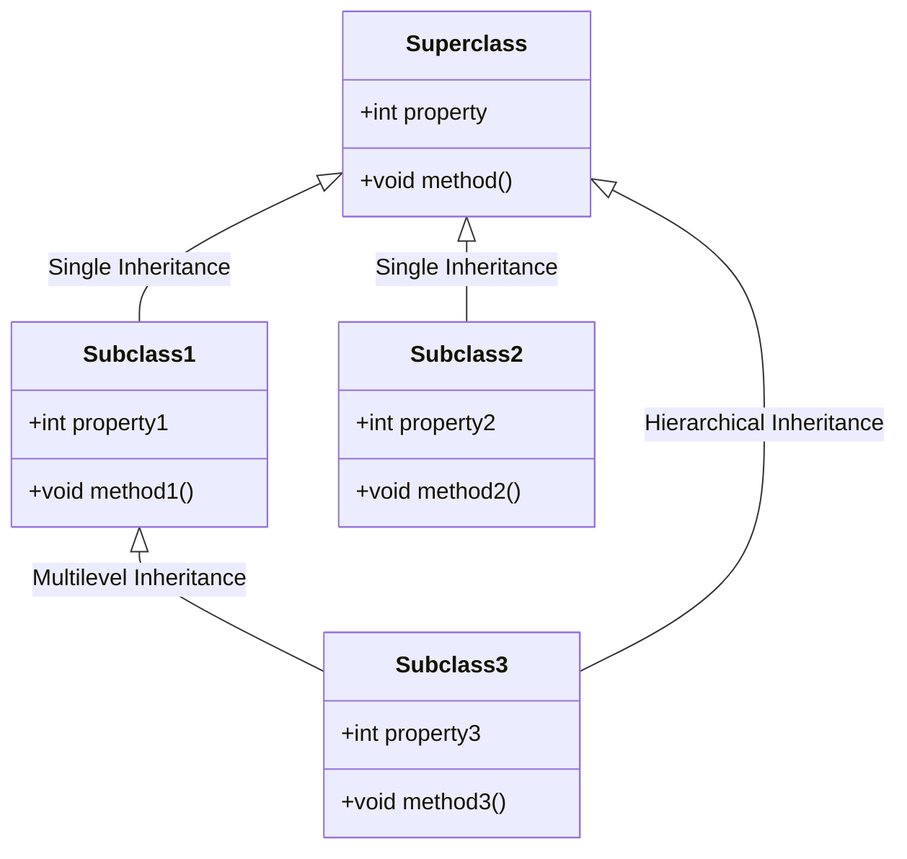
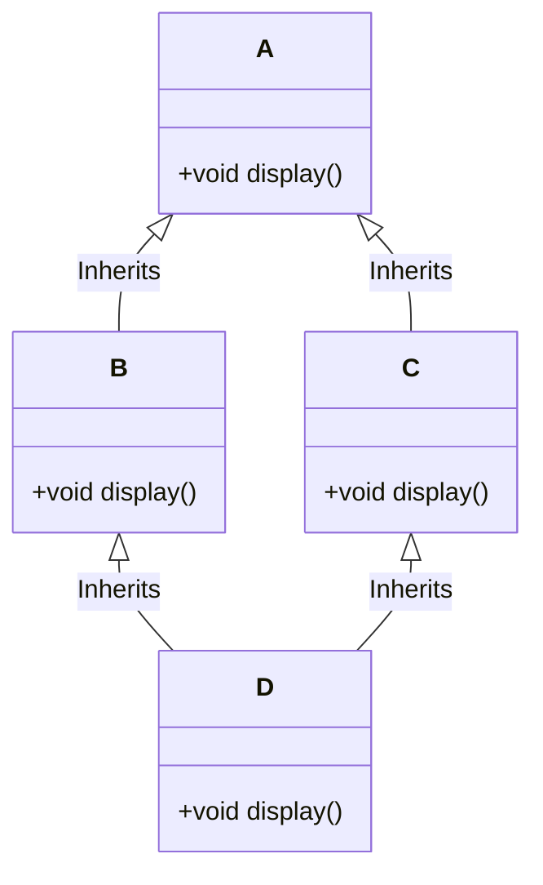
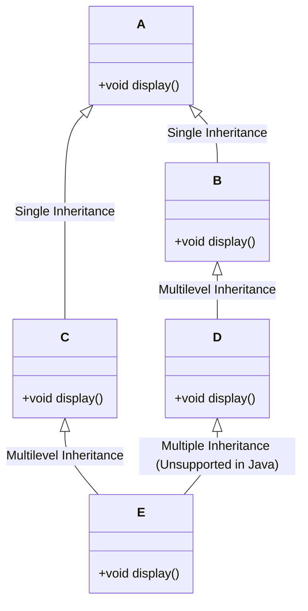
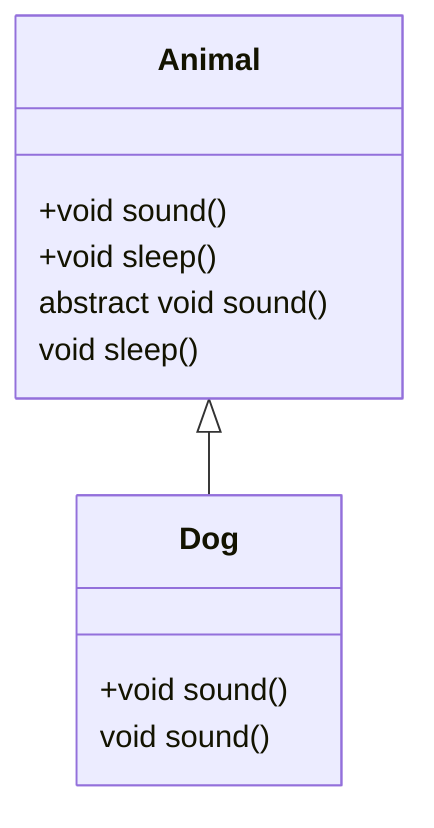
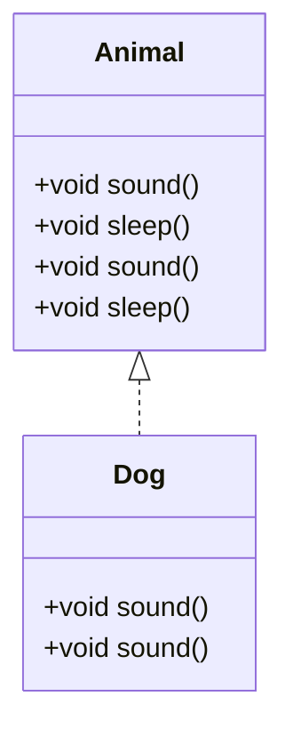

# **OOP(Object-Oriented Programming System)**

OOP is a programming paradigm centered around objects rather than functions. It allows for modular, reusable, and organized code. The key principles of OOP are encapsulation, inheritance, polymorphism, and abstraction.

## **Pillars of OOPs**

- **Encapsulation:** Wrapping data (variables) and code (methods) together into a single unit (class). It helps in hiding the internal state of the object from the outside world.
- **Inheritance:** A mechanism where one class acquires the properties and behaviors (methods) of another class.
- **Polymorphism:** The ability to take many forms. It allows one interface to be used for a general class of actions, making the code more flexible.
- **Abstraction:** Hiding the complex implementation details and showing only the essential features of the object.

The four pillars of Object-Oriented Programming (OOP) are **Encapsulation**, **Inheritance**, **Polymorphism**, and **Abstraction**. Each of these pillars has associated keywords in Java that help implement these concepts.

### 1. **Encapsulation**

- **Keywords:**

  - `private`: Used to restrict access to class members (fields and methods). Only accessible within the same class.
  - `protected`: Allows access within the same package and subclasses.
  - `public`: Allows access from any other class.
  - `getter` and `setter` methods: Used to control access to private fields by providing public methods to get and set values.

  **Example:**

```java
   class Person {
       private String name;  // private field

       public String getName() { // getter method
           return name;
       }

       public void setName(String name) { // setter method
           this.name = name;
       }
   }
```

### 2. **Inheritance**

- **Keywords:**

  - `extends`: Used when a class inherits from another class.
  - `super`: Used to refer to the superclass (parent class) and access its members or constructors.

  **Example:**

```java
   class Animal {
       void sound() {
           System.out.println("Animal makes a sound");
       }
   }

   class Dog extends Animal {
       void sound() {
           super.sound(); // Calls the parent class's method
           System.out.println("Dog barks");
       }
   }
```

### 3. **Polymorphism**

- **Keywords:**

  - `overloading`: Implemented using methods with the same name but different parameters.
  - `overriding`: Implemented using the `@Override` annotation to provide a new implementation of a method in a subclass.
  - `instanceof`: Used to check the type of an object during runtime.

  **Example:**

```java
   // Overloading
   class MathOperations {
       int add(int a, int b) {
           return a + b;
       }

       int add(int a, int b, int c) {
           return a + b + c;
       }
   }

   // Overriding
   class Animal {
       void sound() {
           System.out.println("Animal makes a sound");
       }
   }

   class Dog extends Animal {
       @Override
       void sound() {
           System.out.println("Dog barks");
       }
   }
```

### 4. **Abstraction**

- **Keywords:**

  - `abstract`: Used to define abstract classes and methods. Abstract methods do not have a body and must be implemented by subclasses.
  - `interface`: Used to define interfaces, which are a form of abstraction where only method signatures are provided.

  **Example:**

```java
   // Abstract Class
   abstract class Animal {
       abstract void sound(); // Abstract method

       void sleep() {
           System.out.println("Animal is sleeping");
       }
   }

   class Dog extends Animal {
       @Override
       void sound() {
           System.out.println("Dog barks");
       }
   }

   // Interface
   interface AnimalBehavior {
       void sound(); // Abstract method

       default void sleep() { // Default method
           System.out.println("Animal is sleeping");
       }
   }

   class Dog implements AnimalBehavior {
       @Override
       public void sound() {
           System.out.println("Dog barks");
       }
   }
```

### Summary:

- **Encapsulation**: `private`, `protected`, `public`, `getter`, `setter`
- **Inheritance**: `extends`, `super`
- **Polymorphism**: `overloading`, `overriding`, `@Override`, `instanceof`
- **Abstraction**: `abstract`, `interface`

These keywords are fundamental in implementing the four pillars of OOP in Java.

### 3. **Class and Objects**

- **Class:** A blueprint or template for creating objects. It defines properties and behaviors (methods) of the objects.
- **Object:** An instance of a class that represents a real-world entity.

**Example:**

```java
class Car {
    String model;
    int year;

    void start() {
        System.out.println("Car is starting...");
    }
}

public class Main {
    public static void main(String[] args) {
        Car myCar = new Car(); // Object creation
        myCar.model = "Tesla";
        myCar.year = 2023;
        myCar.start();
    }
}
```

### 4. **Constructors and Destructors**

- **Constructor:** A special method that is called when an object is instantiated. It is used to initialize the object.
- **Destructor:** Java uses garbage collection to manage memory, so it doesn't have explicit destructors like in C++. The `finalize()` method can be used, but it's rarely needed.

**Example:**

```java
class Car {
    String model;
    int year;

    // Constructor
    Car(String model, int year) {
        this.model = model;
        this.year = year;
    }

    void start() {
        System.out.println(model + " is starting...");
    }
}

public class Main {
    public static void main(String[] args) {
        Car myCar = new Car("Tesla", 2023);
        myCar.start();
    }
}
```

### 5. **Function Overloading**

Function overloading allows multiple methods in the same class to have the same name but different parameters (type or number).

**Example:**

```java
class MathOperations {
    int add(int a, int b) {
        return a + b;
    }

    int add(int a, int b, int c) {
        return a + b + c;
    }
}

public class Main {
    public static void main(String[] args) {
        MathOperations math = new MathOperations();
        System.out.println(math.add(2, 3));       // Output: 5
        System.out.println(math.add(2, 3, 4));    // Output: 9
    }
}
```

### 6. **Operator Overloading and Method Overriding**

- **Operator Overloading:** Java does not support operator overloading. However, it is supported in languages like C++.
- **Method Overriding:** A subclass provides a specific implementation of a method that is already defined in its superclass.

**Example of Method Overriding:**

```java
class Animal {
    void sound() {
        System.out.println("Animal makes a sound");
    }
}

class Dog extends Animal {
    @Override
    void sound() {
        System.out.println("Dog barks");
    }
}

public class Main {
    public static void main(String[] args) {
        Dog dog = new Dog();
        dog.sound(); // Output: Dog barks
    }
}
```

### 7. **Abstract Class**

An abstract class cannot be instantiated and may contain abstract methods, which are methods without a body. Subclasses must provide implementations for these abstract methods.

**Example:**

```java
abstract class Animal {
    abstract void sound();

    void sleep() {
        System.out.println("Animal is sleeping");
    }
}

class Dog extends Animal {
    @Override
    void sound() {
        System.out.println("Dog barks");
    }
}

public class Main {
    public static void main(String[] args) {
        Dog dog = new Dog();
        dog.sound();
        dog.sleep();
    }
}
```

### 8. **Interface**

An interface is like a contract that a class can implement. It can only contain abstract methods (until Java 8, after which default methods were introduced).

**Example:**

```java
interface Animal {
    void sound();
}

class Dog implements Animal {
    public void sound() {
        System.out.println("Dog barks");
    }
}

public class Main {
    public static void main(String[] args) {
        Dog dog = new Dog();
        dog.sound();
    }
}
```

### 9. **Virtual Functions (In Java: Overridable Methods)**

In Java, all non-static, non-private methods are "virtual" by default, meaning they can be overridden in subclasses.

**Example:**

```java
class Animal {
    void sound() {
        System.out.println("Animal makes a sound");
    }
}

class Dog extends Animal {
    @Override
    void sound() {
        System.out.println("Dog barks");
    }
}

public class Main {
    public static void main(String[] args) {
        Animal myDog = new Dog();
        myDog.sound(); // Output: Dog barks
    }
}
```

### 10. **Early Binding and Late Binding**

- **Early Binding:** Method calls are resolved at compile time. For example, static methods.
- **Late Binding:** Method calls are resolved at runtime. For example, overridden methods in subclasses.

**Example:**

```java
class Animal {
    void sound() {
        System.out.println("Animal makes a sound");
    }
}

class Dog extends Animal {
    @Override
    void sound() {
        System.out.println("Dog barks");
    }
}

public class Main {
    public static void main(String[] args) {
        Animal myDog = new Dog(); // Late binding
        myDog.sound(); // Output: Dog barks
    }
}
```

### 11. **Copy Constructors**

Java does not have a copy constructor like C++. However, you can create a copy of an object using a constructor that takes an object of the same class as an argument.

**Example:**

```java
class Car {
    String model;
    int year;

    // Constructor
    Car(String model, int year) {
        this.model = model;
        this.year = year;
    }

    // Copy Constructor
    Car(Car car) {
        this.model = car.model;
        this.year = car.year;
    }

    void display() {
        System.out.println("Model: " + model + ", Year: " + year);
    }
}

public class Main {
    public static void main(String[] args) {
        Car car1 = new Car("Tesla", 2023);
        Car car2 = new Car(car1); // Copy constructor

        car2.display(); // Output: Model: Tesla, Year: 2023
    }
}
```

These concepts and examples should help you understand and explain OOP principles effectively in your interview.

### Operator Overloading

**Operator Overloading** allows a user-defined data type (like a class) to behave like a primitive data type by defining custom behaviors for operators (like `+`, `-`, `*`, etc.). This feature is common in languages like C++ but **Java does not support operator overloading**. The reason behind this design choice in Java is to keep the language simple and avoid ambiguity in code interpretation.

### Types of Inheritance

**Inheritance** is the mechanism where a new class (child or subclass) derives properties and behaviors from an existing class (parent or superclass). Here are the different types of inheritance:

1. **Single Inheritance:** A subclass inherits from one superclass.
2. **Multiple Inheritance:** A subclass inherits from more than one superclass. (Java **does not** support multiple inheritance directly with classes due to the "Diamond Problem".)
3. **Multilevel Inheritance:** A class inherits from a subclass, making it a parent class for another class.
4. **Hierarchical Inheritance:** Multiple subclasses inherit from a single superclass.
5. **Hybrid Inheritance:** A combination of two or more types of inheritance (like single and multiple inheritance). (Java **does not** support hybrid inheritance directly due to the lack of multiple inheritance.)

### What Java Can and Can't Do in Inheritance

- **Java Can:**

  - Support single, multilevel, and hierarchical inheritance.
  - Use interfaces to achieve the effect of multiple inheritance.
  - Use the `super` keyword to refer to the parent class and invoke constructors or methods from it.
- **Java Can't:**

  - Directly support multiple inheritance with classes. This is to avoid confusion caused by the "Diamond Problem", where a subclass could inherit the same method from multiple parent classes, leading to ambiguity.
  - Support hybrid inheritance directly when it involves multiple inheritance of classes.

### Flowchart for Java Inheritance



This diagram visualizes:

1. **Single Inheritance:** `Subclass1` inherits from `Superclass`.
2. **Multilevel Inheritance:** `Subclass3` inherits from `Subclass1`.
3. **Hierarchical Inheritance:** Both `Subclass1` and `Subclass2` inherit from `Superclass`.

**Note:** Java can achieve an effect similar to multiple inheritance using interfaces, where a class can implement multiple interfaces.

### Diamond Problem in Multiple Inheritance

**Multiple Inheritance** allows a class to inherit from more than one parent class. The **Diamond Problem** arises when a class inherits from two classes that both inherit from the same superclass.

**Problem:**
If both parent classes have a method with the same name and signature, and the child class calls that method, there’s ambiguity about which version of the method the child class should inherit.

### Example in Pseudocode:

Consider the following scenario:

- Class `A` has a method `display()`.
- Class `B` and Class `C` inherit from Class `A` and override the `display()` method.
- Class `D` inherits from both Class `B` and Class `C`.

```plaintext
    A
   / \
  B   C
   \ /
    D
```

If `D` calls `display()`, should it use the `display()` method from `B` or `C`? This ambiguity is the Diamond Problem.

### Why Java Can't Support Multiple Inheritance (Directly)

Java avoids the Diamond Problem by not supporting multiple inheritance with classes. This means a class cannot inherit from more than one superclass. Instead, Java allows a class to implement multiple interfaces, providing a way to use multiple inheritance of types without the Diamond Problem because interfaces do not hold state and do not have method implementations (until Java 8, which introduced default methods).

### Hybrid Inheritance

**Hybrid Inheritance** is a combination of two or more types of inheritance (like single and multiple inheritance). Hybrid inheritance can lead to complexities and ambiguity, especially when multiple inheritance is involved.

### Why Java Can't Support Hybrid Inheritance Directly

Java doesn't support hybrid inheritance directly if it involves multiple inheritance with classes. The reason is to prevent the complexities and ambiguities that arise from the Diamond Problem. However, Java can achieve hybrid inheritance using a combination of classes and interfaces.

### Mermaid Flowchart for Diamond Problem and Hybrid Inheritance

#### 1. **Diamond Problem in Multiple Inheritance**



In this diagram:

- `B` and `C` inherit from `A` and override the `display()` method.
- `D` inherits from both `B` and `C`.
- Ambiguity arises when `D` calls `display()`.

#### 2. **Hybrid Inheritance**



In this diagram:

- `B` and `C` inherit from `A`.
- `D` inherits from `B`, and `E` inherits from both `C` and `D`.
- The multiple inheritance from `D` and `C` to `E` is an example of hybrid inheritance.
- Java cannot support the direct multiple inheritance in `E`, but can achieve similar behavior using interfaces.

### Keywords Used in Inheritance in Java

1. **`extends`:** This keyword is used to indicate that a class is inheriting from a superclass.
2. **`super`:** This keyword refers to the superclass (parent class) and can be used to access methods and constructors of the superclass.
3. **`implements`:** This keyword is used when a class is implementing an interface, which is a type of inheritance for behavior, but not for state.

### Code Examples for All Types of Inheritance in Java

#### 1. **Single Inheritance**

One class inherits from one superclass.

```java
class A {
    void display() {
        System.out.println("Display method in class A");
    }
}

class B extends A {
    void show() {
        System.out.println("Show method in class B");
    }
}

public class Main {
    public static void main(String[] args) {
        B obj = new B();
        obj.display(); // Method inherited from class A
        obj.show();    // Method from class B
    }
}
```

#### 2. **Multilevel Inheritance**

A class inherits from another class, which in turn inherits from another class.

```java
class A {
    void display() {
        System.out.println("Display method in class A");
    }
}

class B extends A {
    void show() {
        System.out.println("Show method in class B");
    }
}

class C extends B {
    void print() {
        System.out.println("Print method in class C");
    }
}

public class Main {
    public static void main(String[] args) {
        C obj = new C();
        obj.display(); // Method inherited from class A
        obj.show();    // Method inherited from class B
        obj.print();   // Method from class C
    }
}
```

#### 3. **Hierarchical Inheritance**

Multiple classes inherit from a single superclass.

```java
class A {
    void display() {
        System.out.println("Display method in class A");
    }
}

class B extends A {
    void show() {
        System.out.println("Show method in class B");
    }
}

class C extends A {
    void print() {
        System.out.println("Print method in class C");
    }
}

public class Main {
    public static void main(String[] args) {
        B objB = new B();
        C objC = new C();

        objB.display(); // Method inherited from class A
        objB.show();    // Method from class B

        objC.display(); // Method inherited from class A
        objC.print();   // Method from class C
    }
}
```

#### 4. **Multiple Inheritance** (Through Interfaces)

Java does not support multiple inheritance with classes, but it can be achieved using interfaces.

```java
interface A {
    void display();
}

interface B {
    void show();
}

class C implements A, B { // Implements multiple interfaces
    public void display() {
        System.out.println("Display method in interface A");
    }

    public void show() {
        System.out.println("Show method in interface B");
    }
}

public class Main {
    public static void main(String[] args) {
        C obj = new C();
        obj.display(); // Method from interface A
        obj.show();    // Method from interface B
    }
}
```

#### 5. **Hybrid Inheritance** (Using Interfaces)

Hybrid inheritance is a combination of two or more types of inheritance. Java allows hybrid inheritance when it involves interfaces.

```java
interface A {
    void display();
}

interface B {
    void show();
}

class C implements A {
    public void display() {
        System.out.println("Display method in interface A");
    }
}

class D extends C implements B {
    public void show() {
        System.out.println("Show method in interface B");
    }
}

public class Main {
    public static void main(String[] args) {
        D obj = new D();
        obj.display(); // Method inherited from class C (which implements interface A)
        obj.show();    // Method from interface B
    }
}
```

### Summary:

- **`extends`** is used for class inheritance.
- **`implements`** is used for interface inheritance.
- **`super`** is used to call the superclass's constructor or methods.

These examples illustrate how inheritance is used in Java across different scenarios.

### Abstract Class vs. Interface in Java

#### **Technical Explanation**

- **Abstract Class:**

  - An abstract class in Java is a class that cannot be instantiated directly. It can contain both abstract methods (without a body) and concrete methods (with a body).
  - Abstract classes are used when you want to share code among several closely related classes, but you want to ensure that instances of the class itself are never created.
  - An abstract class can have constructors, fields, and method implementations.
  - A class can extend only one abstract class (single inheritance).
- **Interface:**

  - An interface in Java is a completely abstract type that contains only abstract methods (prior to Java 8). From Java 8 onwards, interfaces can also have default and static methods with a body.
  - Interfaces are used to define a contract that other classes must follow. They are ideal for scenarios where you want to define capabilities that can be shared across multiple classes (even unrelated ones).
  - Interfaces cannot have constructors or state (fields) (though constants can be defined).
  - A class can implement multiple interfaces, providing a way to achieve multiple inheritance in Java.

#### **Easy Explanation**

- **Abstract Class:**
  Think of an abstract class like a partially built house. It has a foundation and some walls (concrete methods), but you can't live in it (instantiate it) because it's not complete. You have to build upon it (extend it) to make it complete.
- **Interface:**
  An interface is like a blueprint or a set of rules. If you're building a house, the interface tells you that you must have certain features (methods), like doors and windows, but it doesn't tell you how to build them. You can use this blueprint in different projects (classes), even if the projects are very different.

### Code Examples

#### **Abstract Class in Java**

```java
abstract class Animal {
    abstract void sound(); // Abstract method

    void sleep() {
        System.out.println("This animal is sleeping.");
    }
}

class Dog extends Animal {
    @Override
    void sound() {
        System.out.println("Dog barks");
    }
}

public class Main {
    public static void main(String[] args) {
        Dog myDog = new Dog();
        myDog.sound();  // Output: Dog barks
        myDog.sleep();  // Output: This animal is sleeping.
    }
}
```

#### **Interface in Java**

```java
interface Animal {
    void sound(); // Abstract method

    default void sleep() { // Default method
        System.out.println("This animal is sleeping.");
    }
}

class Dog implements Animal {
    @Override
    public void sound() {
        System.out.println("Dog barks");
    }
}

public class Main {
    public static void main(String[] args) {
        Dog myDog = new Dog();
        myDog.sound();  // Output: Dog barks
        myDog.sleep();  // Output: This animal is sleeping.
    }
}
```

### Mermaid Charts

#### 1. **Abstract Class Diagram**



#### 2. **Interface Diagram**



### Key Points:

- In the **abstract class** diagram, `Animal` is partially implemented and `Dog` extends it to provide specific functionality.
- In the **interface** diagram, `Animal` is a contract (interface) that `Dog` must follow, but it can also provide some default behavior.

These explanations, along with code examples and diagrams, should give you a solid understanding of abstract classes and interfaces in Java.
