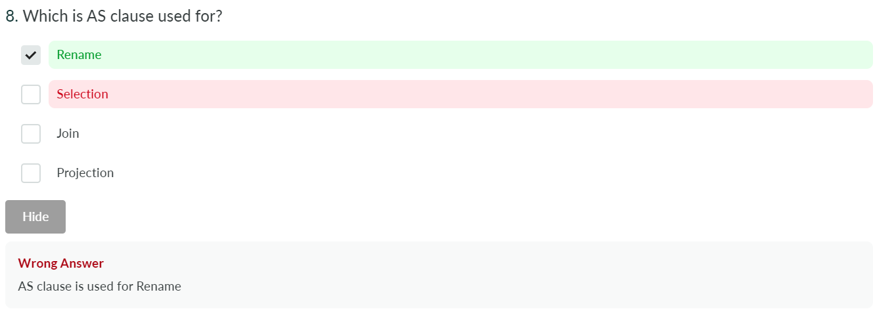
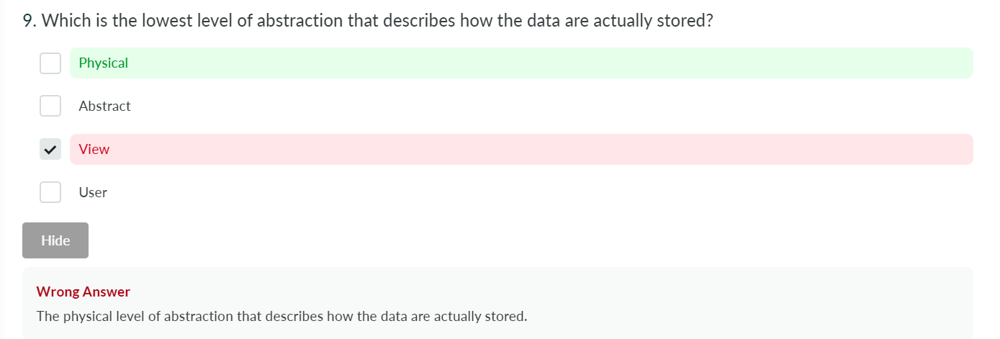
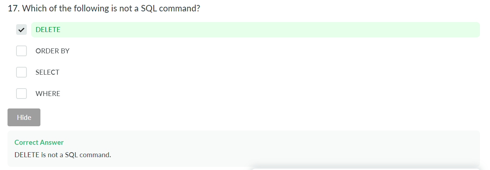
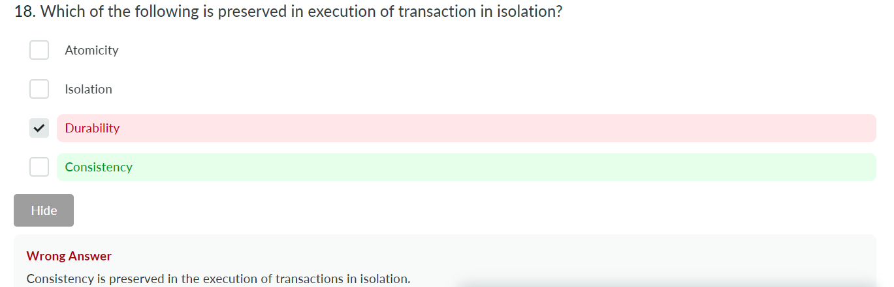
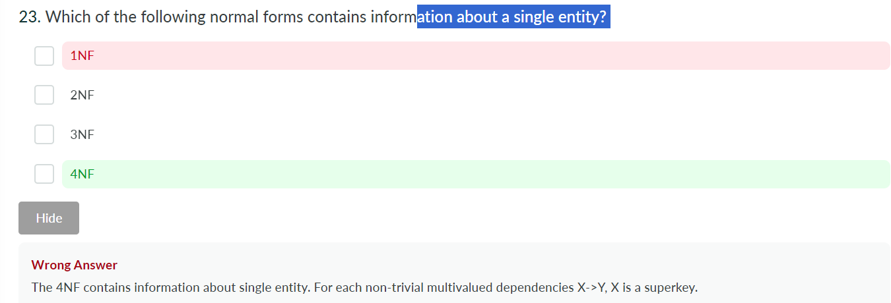
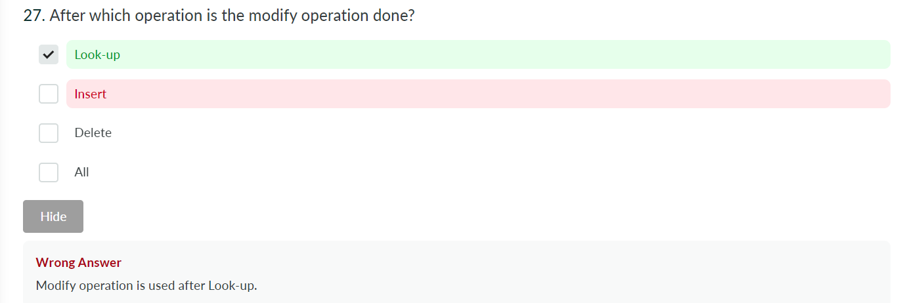
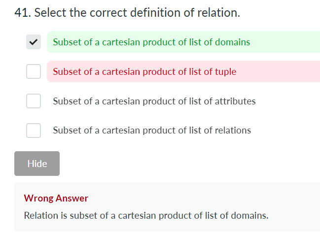
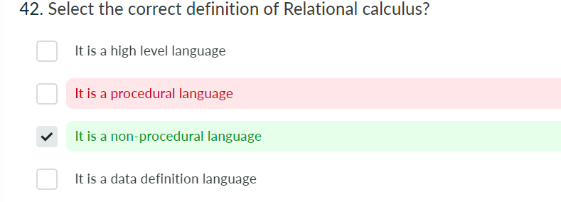

# Chapter 1

### Data

- **Definition:** Characteristics or attributes, either qualitative (descriptive) or quantitative (numerical), collected through observation. Any facts and figures about an entity are termed as data.
- **Importance:** Facilitates analysis, supports decision-making, and is fundamental to research.

### Information

- **Definition:** Data becomes information when analyzed and placed in context, providing a basis for understanding and decision-making.

### Database

- **Definition:** A structured collection of data that enables easy access, management, and updates, typically stored electronically in computer systems.

### Database Management System (DBMS)

- **Definition:** Software that facilitates efficient data storage, retrieval, and management in databases.
- **Functions:**
  - Ensures data safety, integrity, accessibility, and concurrency control.
  - Supports data querying, reporting, and analytics for informed decision-making.

---

### Difference between File System and DBMS

| **Aspect**            | **File System**                                         | **DBMS**                                          |
| --------------------------- | ------------------------------------------------------------- | ------------------------------------------------------- |
| **Data Access**       | Slower due to unstructured querying                           | Structured querying for quicker access                  |
| **Data Isolation**    | Challenges in correlating data across files                   | Facilitates data integration, reducing isolation issues |
| **Data Integrity**    | Risk of inadvertent alterations                               | Features to prevent unauthorized alterations            |
| **Atomicity**         | Potential inconsistency due to incomplete operations          | Supports transaction properties like atomicity          |
| **Concurrent Access** | Conflicts and inconsistencies with simultaneous modifications | Advanced concurrency control for multiple users         |

---

### Data Abstraction Levels in DBMS

| **Level**    | **Description**                                                             |
| ------------------ | --------------------------------------------------------------------------------- |
| **Physical** | Lowest level, manages data storage on hardware, handled by DB administrator.      |
| **Logical**  | Middle level, represents data as entity sets and relationships.                   |
| **View**     | Highest level, displays only portions of the database relevant to user interests. |

---

### Data Independence

- **Physical Data Independence:** The ability to modify internal schema without affecting the conceptual schema (e.g., reorganizing files, modifying indexes).
- **Logical Data Independence:** The ability to change the conceptual schema without altering external schemas or application programs (e.g., adding/removing entities).

---

### Instance vs. Schema

| **Aspect**   | **Description**                                                    |
| ------------------ | ------------------------------------------------------------------------ |
| **Instance** | Collection of data in the database at a specific moment (snapshot).      |
| **Schema**   | Overall design of the database, defining its structure and organization. |

---

### OLAP vs. OLTP

| **Aspect**           | **OLAP (Online Analytical Processing)**  | **OLTP (Online Transaction Processing)** |
| -------------------------- | ---------------------------------------------- | ---------------------------------------------- |
| **Primary Function** | Complex data analysis and reporting            | Handles daily transactional data processing    |
| **Database Design**  | Star or snowflake schema for read optimization | Normalized schema for write optimization       |
| **Query Complexity** | Complex queries with aggregations              | Simple CRUD operations                         |
| **Data Volume**      | Large volumes for historical analysis          | High number of small transactions              |
| **Response Time**    | Slower due to complex queries                  | Fast to support high transaction rates         |

---

### Types of Databases

| **Type**                  | **Description**                                                     | **Example**                                         |
| ------------------------------- | ------------------------------------------------------------------------- | --------------------------------------------------------- |
| **Commercial Database**   | Used in business for handling large transactions and customer data        | Salesforce (CRM system)                                   |
| **Multimedia Database**   | Stores images, audio, and video for managing multimedia content           | Adobe Experience Manager                                  |
| **Deductive Database**    | Uses logic programming for complex, analytical queries                    | Datalog-based systems                                     |
| **Temporal Database**     | Tracks changing data over time for time-based queries                     | Historical trading databases (e.g., stock price tracking) |
| **Geographical Database** | Organizes and analyzes geographical data for spatial analysis and mapping | ArcGIS (GIS system)                                       |

---

### Roles of Database Administrator (DBA)

- **Schema Definition:** Outlines the original database schema.
- **Storage Structure and Access Method Definition:** Defines appropriate storage structures and access methods.
- **Schema/Physical Organization Modification:** Alters schema or physical organization when needed.
- **Authorization Granting:** Manages data access permissions for different users.
- **Integrity Constraints:** Maintains data accuracy and consistency.

---

### DBMS Architecture Components

| **Component**       | **Sub-components/Functions**                                                          |
| ------------------------- | ------------------------------------------------------------------------------------------- |
| **Query Processor** | DML Compiler, DDL Interpreter, Embedded DML Pre-compiler, Query Optimizer                   |
| **Storage Manager** | Authorization Manager, Integrity Manager, Transaction Manager, File Manager, Buffer Manager |
| **Disk Storage**    | Data Files, Data Dictionary, Indices                                                        |

---

### DBMS Architecture Levels

| **Level**            | **Description**                                                                                |
| -------------------------- | ---------------------------------------------------------------------------------------------------- |
| **Internal Level**   | Physical storage of data in hardware, manages compression and indexing.                              |
| **Conceptual Level** | Logical layout of the database, focusing on tables, attributes, and relationships.                   |
| **External Level**   | User interface level, tailored to provide specific views and interactions for different user groups. |

This summary and tabular representation condenses the key points of the content effectively for easy reference.

---

# **ER Diagram Overview**

- **Developed by**: Dr. Peter Chen in 1976.
- **Purpose**: Conceptual diagrammatic data representation for easy comprehension, especially for non-technical users.
- **Key Concept**: Entities and their relationships are modeled to create a **schema** representing real-world enterprise interactions.

---

### **Key Components of ER Diagrams**

#### **Entities**

- **Definition**: Real-world objects, both concrete (e.g., car, pen) and abstract (e.g., account, course).
- **Entity Set**: A collection of similar entities sharing the same properties or attributes.
- **Representation**: A rectangle in ER diagrams and as a table (row/record) in relational models.

#### **Types of Entities**

- **Tangible**: Physically exists (e.g., car, locker).
- **Intangible**: Exists logically (e.g., account, video).

#### **Attributes**

- **Definition**: Descriptive properties or characteristics of entities.
- **Representation**: Ellipses in ER diagrams, independent columns in relational models.

#### **Types of Attributes**

- **Single-Valued**: Holds a single value (e.g., Aadhaar number).
- **Multi-Valued**: Can have multiple values (e.g., phone numbers).
- **Simple**: Cannot be subdivided (e.g., age).
- **Composite**: Can be subdivided into simpler attributes (e.g., full name into first name, last name).
- **Stored**: Permanently stored (e.g., Date of Birth).
- **Derived**: Calculated from other attributes (e.g., Age from DOB).

---

### **Relationships**

- **Definition**: Association between two or more entities.
- **Representation**: Diamonds in ER diagrams; tables or foreign keys in relational models.

#### **Types of Relationships**

- **Unary**: Involves one entity set (self-referential).
- **Binary**: Involves two entity sets (most common).
- **Ternary/Quaternary/N-ary**: Involves three, four, or more entities.

---

### **Structural Constraints**

- **Cardinality Ratios**: Defines the number of entities that can be associated via a relationship:

  - **1:1** (One to One)
  - **1:M** (One to Many)
  - **M:1** (Many to One)
  - **M:N** (Many to Many)
- **Participation Constraints**: Indicates whether participation is partial or total.

---

### **Strong and Weak Entity Sets**

- **Strong Entity Set**: Has a primary key, making tuples distinguishable.
- **Weak Entity Set**: Lacks a primary key, dependent on a strong entity set.
  - **Represented by**: Double rectangle in ER diagrams.
  - **Identifying Relationship**: Many-to-One association between weak and strong entity sets, depicted as a double diamond.

---

### **Conversion from ER Diagram to Relational Model**

- **Entity Sets**: Convert strong/weak entity sets into tables.
- **Relationships**:
  - **Unary**: Add a new column as a foreign key.
  - **1:1**: Add primary key from one entity as foreign key in the other.
  - **1:N**: Add primary key of the "1" side as foreign key on the "N" side.
  - **M:N**: Create a new table with primary keys from both entities.
- **Attributes**:
  - **Multi-Valued**: Use a separate table.

---

Sure! Here are some additional points about ER Diagrams, including the types of ellipses used and other important aspects:

### 1. **Ellipses in ER Diagrams:**

- **Simple Ellipse (Single Line)**: Represents **single-valued attributes**, which have only one value for a particular entity (e.g., Age, Aadhar No.).
- **Double Ellipse**: Represents **multi-valued attributes**, which can have more than one value for an entity (e.g., Phone Numbers, Emails).
- **Dashed Ellipse**: Represents **derived attributes**, whose values can be derived from other attributes (e.g., Age derived from Date of Birth).
- **Ellipses inside an Ellipse (Composite Attribute)**: Represents **composite attributes**, which can be further broken down into sub-attributes (e.g., Address can be broken down into Street, City, Zip Code).

### 2. **Entity Representation:**

- **Rectangle**: Represents **entities** or **entity sets**. Entities are distinguishable objects in the real world. An entity set is a collection of entities sharing the same attributes.
- **Double Rectangle**: Represents a **weak entity set**. A weak entity is dependent on a strong entity and lacks a primary key. It requires a **discriminator** (partial key) and an identifying relationship with a strong entity.

### 3. **Relationship Representation:**

- **Diamond**: Represents **relationships** between entities. It shows how two or more entities are associated.
- **Double Diamond**: Represents an **identifying relationship** between a weak entity and a strong entity.
- **N-ary Relationship**: When more than two entities are involved in a relationship, an n-ary relationship is shown using a diamond with multiple connections.

### 4. **Types of Relationships and Participation:**

- **Cardinality Ratios**: Define the number of instances of an entity that can be associated with another entity in a relationship:
  - **1:1 (One-to-One)**: Each entity in A can be related to at most one entity in B, and vice versa.
  - **1:N (One-to-Many)**: Each entity in A can be related to many entities in B, but each entity in B can relate to only one entity in A.
  - **M:1 (Many-to-One)**: Many entities in A can be related to one entity in B.
  - **M:N (Many-to-Many)**: Entities in A can relate to many entities in B, and vice versa.
- **Participation Constraints**:
  - **Total Participation (Double Line)**: Every instance of an entity must participate in the relationship.
  - **Partial Participation (Single Line)**: Some instances of an entity may participate in the relationship.

### 5. **Attributes in ER Diagram:**

- **Key Attribute**: Attributes that uniquely identify an entity in an entity set, typically represented with an ellipse with the attribute name underlined.
- **Discriminator Attribute**: An attribute of a weak entity set that helps identify entities within that set, but not uniquely.
- **Multivalued Attribute**: Represented by a **double ellipse**, indicating that multiple values for that attribute can be associated with a single entity.

### 6. **Conversion of ER Diagram to Relational Model:**

- **Strong Entities**: Converted to tables where attributes become columns.
- **Weak Entities**: Converted into a table where they take the primary key from the strong entity they are related to.
- **Relationships**: Converted into tables (for many-to-many relationships) or incorporated into existing tables by adding foreign keys (for one-to-one, one-to-many relationships).

### 7. **Recursive Relationships**:

- These involve the same entity participating more than once in a relationship, often with different roles. These are sometimes referred to as **unary relationships** and are represented with a self-referencing arrow.

### 8. **Specialization and Generalization:**

- **Specialization**: An entity set is divided into smaller entity sets based on some distinguishing feature (e.g., Employee into Full-time and Part-time employees). Represented using an **is-a hierarchy**.
- **Generalization**: The opposite of specialization, where two or more entity sets are combined into a higher-level entity set.

### 9. **Aggregation**:

- This is used to represent a relationship between a relationship and other entities. It is depicted by enclosing a relationship set and associated entities inside a larger rectangle.

These are some additional key points that enhance the understanding of the ER diagram and how it represents entities, relationships, and attributes visually.

# MCQ mistakes I learnt from

https://www.interviewbit.com/dbms-mcq/ 

1.

2. 

3. 

4.

5. 

6.

7.

8.

9.

10.
