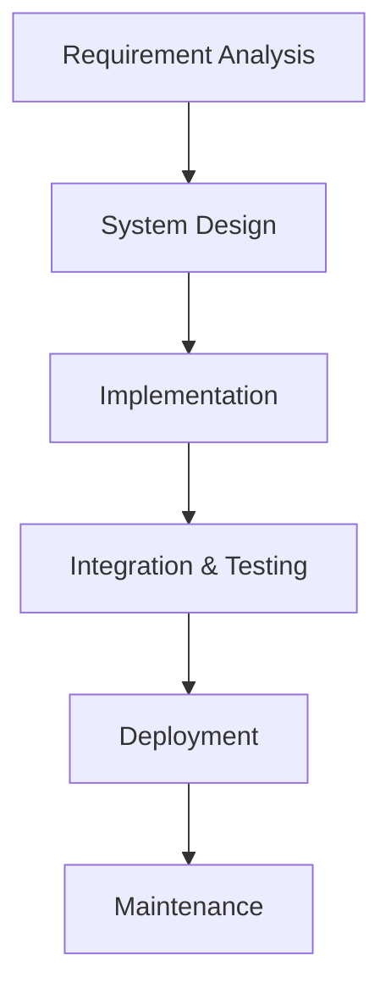
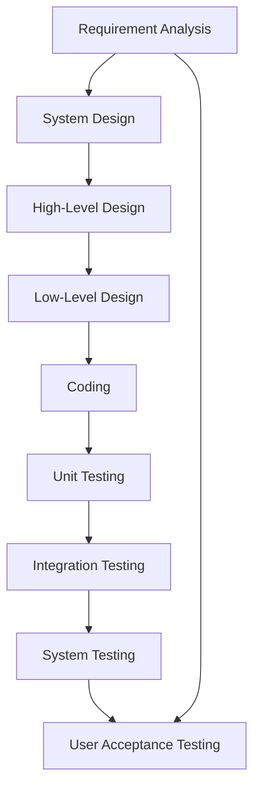
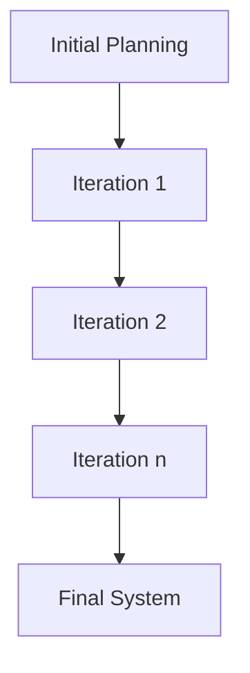
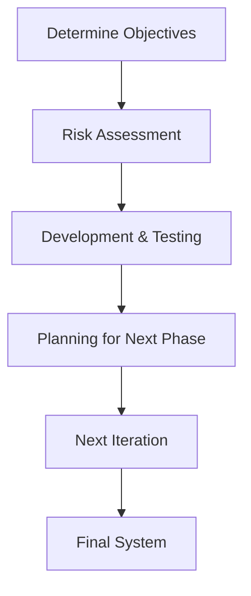
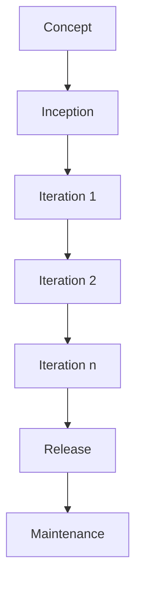
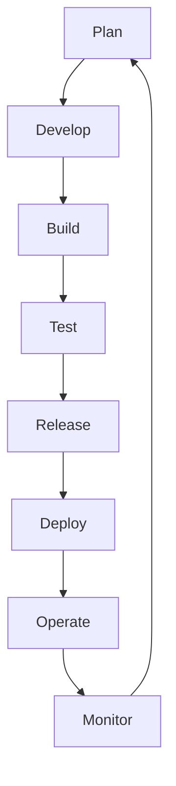
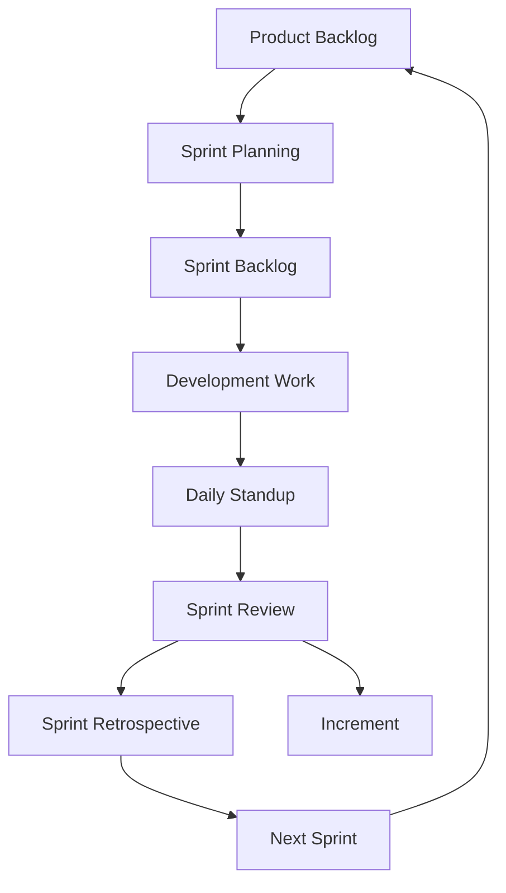

### Software Development Life Cycle (SDLC) Models

The Software Development Life Cycle (SDLC) refers to a process that produces software with the highest quality and lowest cost in the shortest time. There are several SDLC models, each with its own approach and methodologies. Here’s a detailed overview of the most common SDLC models, including Mermaid charts and potential interview questions.

---

### 1. **Waterfall Model**

The Waterfall Model is a sequential design process, often used in software development processes, where progress is seen as flowing steadily downwards (like a waterfall) through phases such as Conception, Initiation, Analysis, Design, Construction, Testing, and Maintenance.

#### **Phases:**

- **Requirement Analysis:** Gathering all system requirements.
- **System Design:** Planning the architecture and design based on requirements.
- **Implementation:** Writing code and transforming design into a functional product.
- **Integration & Testing:** Assembling all parts and verifying that the system works as expected.
- **Deployment:** Releasing the final product to the customer.
- **Maintenance:** Handling post-deployment issues and updating the software.

#### **Mermaid Chart:**

#### **Interview Questions:**

- What are the advantages and disadvantages of the Waterfall Model?
- In which scenarios is the Waterfall Model most effective?
- How would you handle requirement changes in the Waterfall Model?

---

### 2. **V-Model (Verification and Validation)**

The V-Model is an extension of the Waterfall Model where each phase of development corresponds directly to a testing phase. It's also known as the Verification and Validation model.

#### **Phases:**

- **Requirement Analysis:** Requirements are gathered and analyzed.
- **System Design:** System architecture is designed.
- **High-Level Design (HLD):** High-level components are designed.
- **Low-Level Design (LLD):** Detailed design of components.
- **Coding:** Actual coding and development.
- **Unit Testing:** Testing of individual components.
- **Integration Testing:** Testing combined modules together.
- **System Testing:** Testing the entire system as a whole.
- **User Acceptance Testing (UAT):** Final validation with end users.

#### **Mermaid Chart:**

#### **Interview Questions:**

- How does the V-Model ensure quality?
- What are the key differences between the V-Model and the Waterfall Model?
- In what situations would you choose the V-Model over Agile?

---

### 3. **Iterative Model**

The Iterative Model is a type of SDLC model that doesn’t start with a full set of requirements. Instead, software is developed in small sections, with repeated cycles (iterations).

#### **Phases:**

- **Initial Planning:** Basic requirement analysis and planning.
- **Iteration 1:**
  - Requirement Gathering
  - Design
  - Development
  - Testing
- **Iteration 2:** Repeat the same cycle, incorporating feedback and making improvements.
- **Final Iteration:** The cycle continues until the final system is delivered.

#### **Mermaid Chart:**

#### **Interview Questions:**

- How does the Iterative Model handle changes in requirements?
- What are the advantages of using the Iterative Model?
- Can you give an example of when you used the Iterative Model in a project?

---

### 4. **Spiral Model**

The Spiral Model combines the idea of iterative development with the systematic aspects of the Waterfall Model. It focuses on risk assessment and minimization, making it ideal for large, complex, and high-risk projects.

#### **Phases:**

- **Determine Objectives:** Identify objectives, alternatives, and constraints.
- **Risk Assessment and Reduction:** Analyze risks and explore options.
- **Development and Testing:** Develop and test the next iteration.
- **Planning:** Plan the next phase of the project.
- **Repeat:** Continue spiraling outwards until the project is complete.

#### **Mermaid Chart:**

#### **Interview Questions:**

- What makes the Spiral Model different from other SDLC models?
- How does the Spiral Model handle risks in a project?
- Describe a project where the Spiral Model would be more effective than Agile.

---

### 5. **Agile Model**

The Agile Model promotes continuous iteration of development and testing throughout the SDLC process. It breaks down the product into small, incremental builds, and is highly flexible to changes.

#### **Phases:**

- **Concept:** Defining the high-level goals and scope.
- **Inception:** Identifying team members, funding, and initial requirements.
- **Iteration/Increment:** The project is developed in iterations, each with planning, development, testing, and deployment.
- **Release:** The final product is released after multiple iterations.
- **Maintenance:** Ongoing support and updates after release.

#### **Mermaid Chart:**

#### **Interview Questions:**

- How does Agile handle changing requirements?
- What are the roles of a Scrum Master and Product Owner in Agile?
- Can you describe a time when you used Agile methodology in a project?

---

### 6. **DevOps Model**

The DevOps Model emphasizes collaboration between development and operations teams, aiming to deliver software faster and more reliably by automating and integrating the processes of software development and IT operations.

#### **Phases:**

- **Plan:** Planning and defining requirements.
- **Develop:** Writing and testing code.
- **Build:** Building the software into deployable units.
- **Test:** Automated and manual testing.
- **Release:** Deploying the software to production.
- **Deploy:** Continuous deployment to production environments.
- **Operate:** Monitoring and logging systems.
- **Monitor:** Continuous monitoring and feedback.

#### **Mermaid Chart:**

#### **Interview Questions:**

- How does DevOps differ from traditional SDLC models?
- What tools are commonly used in a DevOps pipeline?
- Can you explain Continuous Integration and Continuous Deployment (CI/CD) in the context of DevOps?

---

### Summary of Interview Questions for All Models:

1. **General SDLC Questions:**

   - What are the different phases of SDLC?
   - How do you choose the appropriate SDLC model for a project?
   - Can you describe a situation where you had to adapt the SDLC process for a specific project?
2. **Specific Model Questions:**

   - Explain how risk management is handled in the Spiral Model.
   - What are the advantages of using Agile over Waterfall?
   - How does the V-Model ensure that testing is an integral part of the SDLC?
3. **Practical Application:**

   - Describe a project where you used a specific SDLC model. What were the challenges and how did you overcome them?
   - How do you ensure quality and meet deadlines in iterative or Agile models?
   - Can you give an example of how you handled scope changes in an SDLC model?

These charts and questions should help you prepare effectively for an interview, showcasing your understanding of different SDLC models and their applications.

### Agile Model

The Agile Model is an iterative and incremental approach to software development, emphasizing flexibility, collaboration, and customer satisfaction. Agile allows for changes and adaptations throughout the project lifecycle, making it highly suitable for projects where requirements may evolve.

#### **Core Principles of Agile:**

- **Customer Collaboration:** Engage with customers throughout the project to ensure the final product meets their needs.
- **Working Software:** Deliver functional software frequently, in short iterations.
- **Responding to Change:** Adapt to changes even late in the development process.
- **Individuals and Interactions:** Value communication and collaboration among team members.

#### **Phases of Agile:**

1. **Concept:** Defining the high-level scope and objectives.
2. **Inception:** Forming the team, securing funding, and identifying initial requirements.
3. **Iteration/Increment:** Developing, testing, and reviewing small, functional pieces of the software in short cycles (iterations).
4. **Release:** Delivering the final product after multiple iterations.
5. **Maintenance:** Providing ongoing support and making necessary updates post-release.

#### **Mermaid Chart for Agile Model:**

### Scrum Framework

Scrum is one of the most popular frameworks within the Agile methodology. It provides a structured way for teams to work collaboratively on complex projects.

#### **Key Roles in Scrum:**

1. **Product Owner:** Represents the stakeholders and customers. Defines the product backlog and prioritizes features based on customer needs.
2. **Scrum Master:** Facilitates the Scrum process, ensures the team adheres to Agile principles, and removes obstacles that might impede progress.
3. **Development Team:** A cross-functional group that works on delivering the product incrementally.

#### **Artifacts in Scrum:**

1. **Product Backlog:** A prioritized list of features, enhancements, and fixes required for the product.
2. **Sprint Backlog:** A selection of items from the product backlog that the team commits to complete in a sprint.
3. **Increment:** The usable, potentially shippable product resulting from a sprint.

#### **Ceremonies in Scrum:**

1. **Sprint Planning:** A meeting to plan the work to be done in the upcoming sprint.
2. **Daily Standup (Daily Scrum):** A short, daily meeting where the team discusses progress, plans for the day, and any impediments.
3. **Sprint Review:** A meeting at the end of a sprint where the team demonstrates the work completed.
4. **Sprint Retrospective:** A meeting after the sprint to reflect on what went well, what didn’t, and how to improve.

#### **Mermaid Chart for Scrum Framework:**

### Agile vs. Scrum

While Agile is a broader methodology that can include various frameworks (Scrum, Kanban, XP, etc.), Scrum is a specific framework within Agile. Scrum provides a concrete structure with roles, artifacts, and ceremonies that guide teams through iterative development.

### **Interview Questions:**

1. **Agile:**

   - How does Agile handle changes in project requirements?
   - Can you describe the benefits of delivering software in increments?
   - How do you ensure customer satisfaction in an Agile project?
2. **Scrum:**

   - What are the responsibilities of a Scrum Master?
   - How do you handle a situation where the team cannot complete the sprint backlog?
   - Can you explain the difference between a Product Backlog and a Sprint Backlog?
3. **Practical Application:**

   - Describe a project where you used Agile/Scrum. What were the challenges and how did you overcome them?
   - How do you handle team conflicts in a Scrum environment?
   - Can you give an example of a time when the Product Owner’s priorities changed mid-sprint? How did you handle it?

This detailed overview of Agile and Scrum should help you prepare for discussions in your interview, demonstrating your understanding of these methodologies and how they can be applied in real-world scenarios.
