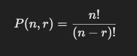
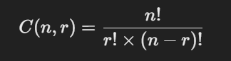

Certainly! Below are the Java methods to calculate permutations and combinations.

### Permutations

Permutations refer to the arrangement of items where the order matters. The number of permutations of `n` items taken `r` at a time is given by:



### Combinations

Combinations refer to the selection of items where the order does not matter. The number of combinations of `n` items taken `r` at a time is given by:



### Java Implementation

```java
public class PermutationCombination {

    // Method to calculate factorial
    public static long factorial(int n) {
        long fact = 1;
        for (int i = 2; i <= n; i++) {
            fact *= i;
        }
        return fact;
    }

    // Method to calculate permutations P(n, r)
    public static long permutation(int n, int r) {
        return factorial(n) / factorial(n - r);
    }

    // Method to calculate combinations C(n, r)
    public static long combination(int n, int r) {
        return factorial(n) / (factorial(r) * factorial(n - r));
    }

    public static void main(String[] args) {
        int n = 5;
        int r = 3;

        long perm = permutation(n, r);
        long comb = combination(n, r);

        System.out.println("P(" + n + ", " + r + ") = " + perm);
        System.out.println("C(" + n + ", " + r + ") = " + comb);
    }
}
```

### Explanation:

1. **Factorial Method**:

   - The `factorial` method computes the factorial of a given number \( n! \). It uses a simple loop to multiply numbers from 2 to `n`.
2. **Permutation Method**:

   - The `permutation` method calculates the number of permutations \( P(n, r) \) using the formula \(\frac{n!}{(n-r)!}\).
3. **Combination Method**:

   - The `combination` method calculates the number of combinations \( C(n, r) \) using the formula \(\frac{n!}{r! \times (n-r)!}\).
4. **Main Method**:

   - In the `main` method, we calculate both the permutation and combination of `n = 5` and `r = 3`, then print the results.

### Output:

Running the above code with `n = 5` and `r = 3` would yield:

```
P(5, 3) = 60
C(5, 3) = 10
```

This code can be used to calculate permutations and combinations for any values of `n` and `r`. Adjust `n` and `r` in the `main` method as needed for different use cases.
