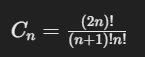
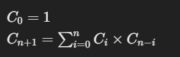

### **Catalan Numbers**

Catalan numbers are a sequence of natural numbers with many applications in combinatorial mathematics. The nth Catalan number is given by the formula:



#### **Recursive Formula**:

Catalan numbers can also be defined recursively:



### **Applications of Catalan Numbers**

Catalan numbers appear in various counting problems, including:

1. **Valid Parentheses Combinations**:

   - The number of valid ways to arrange `n` pairs of parentheses.
2. **Binary Search Trees**:

   - The number of distinct binary search trees that can be constructed with `n` nodes.
3. **Triangulations**:

   - The number of ways to triangulate a convex polygon with `n + 2` sides.
4. **Mountain Ranges**:

   - The number of ways to draw n upstrokes and n downstrokes without the downstrokes going above the upstrokes.
5. **Dyck Paths**:

   - The number of paths along the edges of a grid that do not pass above the diagonal.

### **Code to Compute Catalan Numbers**

Here’s a simple dynamic programming approach to compute the nth Catalan number:

```java
// Catalan Numbers

class Solution {
    public int f(int n) {
        if (n <= 1)
            return 1;
        int ans = 0;
        for (int i = 1; i <= n; i++) {
            ans += f(i - 1) * f(n - i);
        }
        return ans;
    }

    public int numTrees(int n) {

        return f(n);

    }
}
```

### **Applications**

- **Number of binary trees with \( n \) vertices**
- **Number of full binary trees with \( n \) vertices**
- **Number of  n  multisets \{a_1, a_2,  . . . , a_n\}\) of elements \( a_i \) such that \( a_1 + a_2 + . . . . + a_n = 0 \)**
- **Number of ways \( n \) semicircles can be arranged such that no two intersect**
- **Number of permutations for the set \(\{1, 2, \dots, 2n\}\) where \( f \) is an involution that has no fixed points and satisfies the noncrossing condition**
- **Number of ways to arrange \( 2n \) soldiers in two rows in ascending height order**
- **Number of tilings of the staircase shape that can be made with \( n \) rectangles**
- **Number of paths a rook can take from the upper left-hand corner to the lower right-hand corner on an \( n \times n \) chessboard without crossing the main diagonal**
- **Number of ideals in a ring is \( C_{n+1} \)**
- **Number of nilpotent ideals in a ring**

These bullets highlight various combinatorial problems, many of which are related to Catalan numbers or other advanced combinatorial structures.

### **Applications on LeetCode**

Here are some LeetCode problems that involve Catalan numbers:

1. **[Unique Binary Search Trees](https://leetcode.com/problems/unique-binary-search-trees/)** (LeetCode 96):

   - Given `n`, how many structurally unique BST's (binary search trees) that store values 1 ... n?
2. **[Different Ways to Add Parentheses](https://leetcode.com/problems/different-ways-to-add-parentheses/)** (LeetCode 241):

   - Given a string of numbers and operators, return all possible results from computing all the different possible ways to group numbers and operators.
3. **[Generate Parentheses](https://leetcode.com/problems/generate-parentheses/)** (LeetCode 22):

   - Given `n` pairs of parentheses, write a function to generate all combinations of well-formed parentheses.
4. **[Valid Parentheses](https://leetcode.com/problems/valid-parentheses/)** (LeetCode 20):

   - Although not directly related to Catalan numbers, understanding valid parentheses pairs can help with Catalan number applications.
5. **[Number of Valid Parentheses Combinations](https://leetcode.com/problems/number-of-valid-parentheses-combinations/)** (Custom problem):

   - A more direct problem would involve finding the number of valid parentheses combinations, which directly correlates with the nth Catalan number.

### Article

1. https://medium.com/@DeepakMalviya7/what-is-catalan-number-and-its-applications-c9c8eda5f3bf
2. 

### **Summary**

Catalan numbers are incredibly versatile and appear in many combinatorial problems. Understanding how to compute them and recognizing when they apply can be powerful tools for solving a wide variety of problems, especially in competitive programming and algorithm challenges like those on LeetCode.
