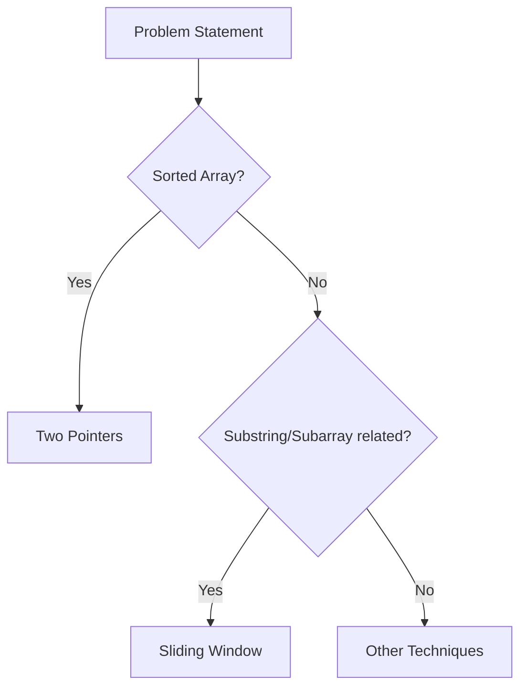

# Documentation: Two Pointers & Sliding Window in Java

---

## 1. Introduction

Efficient problem-solving in **arrays and strings** often requires reducing time complexity from brute-force `O(n²)` to optimized `O(n)` or `O(n log n)`.
Two of the most powerful strategies are:

* **Two Pointers Technique**
* **Sliding Window Technique**

These approaches simplify **searching, subarray/subsequence problems, and optimization tasks** without extra memory overhead.

---

## 2. About the Techniques

### **Two Pointers**

* Two indices (pointers) traverse a data structure (usually arrays or strings).
* Can move **towards each other** (converging) or **in the same direction**.
* Often used in **sorted arrays, linked lists, string manipulation**.

### **Sliding Window**

* A **window** (subarray or substring) moves across the structure.
* Window can be **fixed-size** or **dynamic-size**.
* Optimizes subarray/substring-related problems (like "longest", "smallest", "maximum", etc.).

---

## 3. When to Use

| Technique                | When to Use                                                              |
| ------------------------ | ------------------------------------------------------------------------ |
| **Two Pointers**   | Sorted arrays, pair/triplet problems, palindrome check, merging lists    |
| **Sliding Window** | Subarray/substring problems involving sum, max, min, distinct characters |

---

## 4. Keywords to Identify

| Keywords in Problem Statement                 | Likely Technique         |
| --------------------------------------------- | ------------------------ |
| "Find a pair/triplet with sum…"              | Two Pointers             |
| "Check if string is palindrome"               | Two Pointers             |
| "Merge two sorted arrays/lists"               | Two Pointers             |
| "Longest/Smallest substring with condition…" | Sliding Window (Dynamic) |
| "Maximum sum of k elements"                   | Sliding Window (Fixed)   |
| "Number of subarrays with property…"         | Sliding Window           |

---

## 5. Boilerplate Codes

### **Two Pointers - Converging**

```java
// Example: Check if array has two numbers summing to target
import java.util.Arrays;

class TwoPointersExample {
    public static boolean hasPairWithSum(int[] arr, int target) {
        Arrays.sort(arr);
        int left = 0, right = arr.length - 1;
        while (left < right) {
            int sum = arr[left] + arr[right];
            if (sum == target) return true;
            else if (sum < target) left++;
            else right--;
        }
        return false;
    }
}
```

---

### **Two Pointers - Same Direction**

```java
// Example: Remove duplicates from sorted array
class RemoveDuplicates {
    public static int removeDuplicates(int[] nums) {
        int i = 0;
        for (int j = 1; j < nums.length; j++) {
            if (nums[j] != nums[i]) {
                i++;
                nums[i] = nums[j];
            }
        }
        return i + 1;
    }
}
```

---

### **Sliding Window - Fixed Size**

```java
// Example: Maximum sum of subarray of size k
class SlidingWindowFixed {
    public static int maxSum(int[] arr, int k) {
        int windowSum = 0, maxSum = 0;
        for (int i = 0; i < k; i++) windowSum += arr[i];
        maxSum = windowSum;
        for (int i = k; i < arr.length; i++) {
            windowSum += arr[i] - arr[i - k];
            maxSum = Math.max(maxSum, windowSum);
        }
        return maxSum;
    }
}
```

---

### **Sliding Window - Dynamic Size**

```java
// Example: Longest substring without repeating characters
import java.util.*;

class SlidingWindowDynamic {
    public static int lengthOfLongestSubstring(String s) {
        int left = 0, maxLen = 0;
        Set<Character> set = new HashSet<>();
        for (int right = 0; right < s.length(); right++) {
            while (set.contains(s.charAt(right))) {
                set.remove(s.charAt(left));
                left++;
            }
            set.add(s.charAt(right));
            maxLen = Math.max(maxLen, right - left + 1);
        }
        return maxLen;
    }
}
```

---

## 6. Variations

| Technique      | Variation Example                        |
| -------------- | ---------------------------------------- |
| Two Pointers   | Fast & Slow pointers (Linked List cycle) |
| Two Pointers   | Opposite Ends (Palindrome check)         |
| Sliding Window | Fixed Size (max sum subarray)            |
| Sliding Window | Dynamic Size (longest substring unique)  |

---

## 7. Flow Diagram (Mermaid)



---

## 8. Practice Questions (Starters)

### **LeetCode**

* [167. Two Sum II - Input Array Is Sorted](https://leetcode.com/problems/two-sum-ii-input-array-is-sorted/) → Two Pointers
* [125. Valid Palindrome](https://leetcode.com/problems/valid-palindrome/) → Two Pointers
* [209. Minimum Size Subarray Sum](https://leetcode.com/problems/minimum-size-subarray-sum/) → Sliding Window
* [3. Longest Substring Without Repeating Characters](https://leetcode.com/problems/longest-substring-without-repeating-characters/) → Sliding Window

### **Codeforces**

* "Subarray Sum" problems (div2 A/B level)
* "Two Pointers Technique" tagged problems

### **Coding Ninjas**

* "Pair Sum in Sorted Array"
* "Maximum Subarray Sum with K elements"

---

## 9. Interview-Level Questions (FAANG and Others)

| Company   | Problem                                                                        |
| --------- | ------------------------------------------------------------------------------ |
| Amazon    | Find the longest substring with at most K distinct characters (Sliding Window) |
| Google    | Trapping Rain Water (Two Pointers)                                             |
| Facebook  | Minimum Window Substring (Sliding Window)                                      |
| Microsoft | Merge Intervals / Meeting Rooms (Two Pointers on sorted intervals)             |
| Netflix   | Subarray Product Less Than K (Sliding Window)                                  |
| Apple     | Linked List Cycle detection (Fast & Slow Pointers)                             |

---

## 10. Summary Table

| Feature                 | Two Pointers                           | Sliding Window                  |
| ----------------------- | -------------------------------------- | ------------------------------- |
| Structure               | Usually arrays, strings, linked lists  | Arrays, strings                 |
| Movement                | Towards each other / same direction    | Expanding & shrinking window    |
| Typical Time Complexity | O(n)                                   | O(n)                            |
| Best For                | Pair/Triplet/Palindrome/Merge problems | Subarray/Substring optimization |
