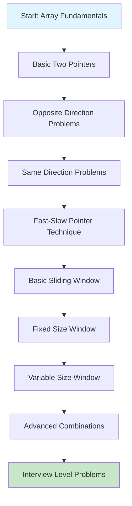
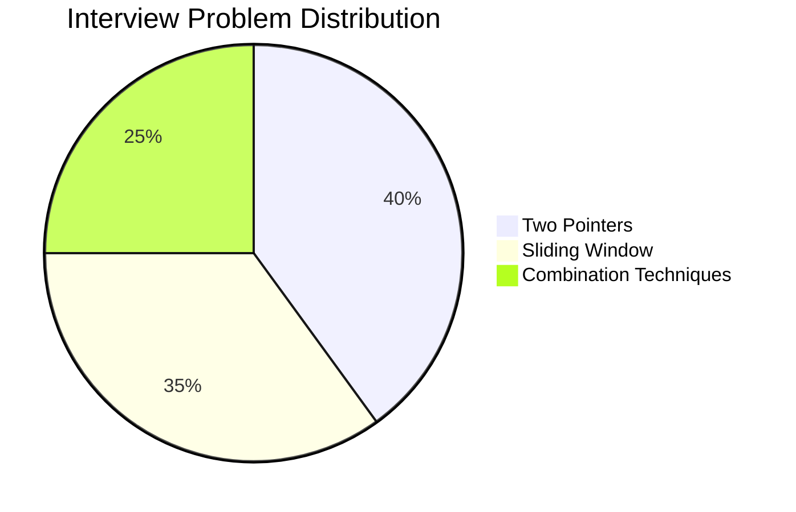

# Two Pointers & Sliding Window in Java

---

## 1. Introduction

Efficient problem-solving in **arrays and strings** often requires reducing time complexity from brute-force `O(n²)` to optimized `O(n)` or `O(n log n)`.
Two of the most powerful strategies are:

* **Two Pointers Technique**
* **Sliding Window Technique**

These approaches simplify **searching, subarray/subsequence problems, and optimization tasks** without extra memory overhead.

---

## 2. About the Techniques

### **Two Pointers**

* Two indices (pointers) traverse a data structure (usually arrays or strings).
* Can move **towards each other** (converging) or **in the same direction**.
* Often used in **sorted arrays, linked lists, string manipulation**.

### **Sliding Window**

* A **window** (subarray or substring) moves across the structure.
* Window can be **fixed-size** or **dynamic-size**.
* Optimizes subarray/substring-related problems (like "longest", "smallest", "maximum", etc.).

---

## 3. When to Use

| Technique                | When to Use                                                              |
| ------------------------ | ------------------------------------------------------------------------ |
| **Two Pointers**   | Sorted arrays, pair/triplet problems, palindrome check, merging lists    |
| **Sliding Window** | Subarray/substring problems involving sum, max, min, distinct characters |

---

## 4. Keywords to Identify

| Keywords in Problem Statement                 | Likely Technique         |
| --------------------------------------------- | ------------------------ |
| "Find a pair/triplet with sum…"              | Two Pointers             |
| "Check if string is palindrome"               | Two Pointers             |
| "Merge two sorted arrays/lists"               | Two Pointers             |
| "Longest/Smallest substring with condition…" | Sliding Window (Dynamic) |
| "Maximum sum of k elements"                   | Sliding Window (Fixed)   |
| "Number of subarrays with property…"         | Sliding Window           |

---

## 5. Boilerplate Codes

### **Two Pointers - Converging**

```java
// Example: Check if array has two numbers summing to target
import java.util.Arrays;

class TwoPointersExample {
    public static boolean hasPairWithSum(int[] arr, int target) {
        Arrays.sort(arr);
        int left = 0, right = arr.length - 1;
        while (left < right) {
            int sum = arr[left] + arr[right];
            if (sum == target) return true;
            else if (sum < target) left++;
            else right--;
        }
        return false;
    }
}
```

---

### **Two Pointers - Same Direction**

```java
// Example: Remove duplicates from sorted array
class RemoveDuplicates {
    public static int removeDuplicates(int[] nums) {
        int i = 0;
        for (int j = 1; j < nums.length; j++) {
            if (nums[j] != nums[i]) {
                i++;
                nums[i] = nums[j];
            }
        }
        return i + 1;
    }
}
```

---

### **Sliding Window - Fixed Size**

```java
// Example: Maximum sum of subarray of size k
class SlidingWindowFixed {
    public static int maxSum(int[] arr, int k) {
        int windowSum = 0, maxSum = 0;
        for (int i = 0; i < k; i++) windowSum += arr[i];
        maxSum = windowSum;
        for (int i = k; i < arr.length; i++) {
            windowSum += arr[i] - arr[i - k];
            maxSum = Math.max(maxSum, windowSum);
        }
        return maxSum;
    }
}
```

---

### **Sliding Window - Dynamic Size**

```java
// Example: Longest substring without repeating characters
import java.util.*;

class SlidingWindowDynamic {
    public static int lengthOfLongestSubstring(String s) {
        int left = 0, maxLen = 0;
        Set<Character> set = new HashSet<>();
        for (int right = 0; right < s.length(); right++) {
            while (set.contains(s.charAt(right))) {
                set.remove(s.charAt(left));
                left++;
            }
            set.add(s.charAt(right));
            maxLen = Math.max(maxLen, right - left + 1);
        }
        return maxLen;
    }
}
```

---

## 6. Variations

| Technique      | Variation Example                        |
| -------------- | ---------------------------------------- |
| Two Pointers   | Fast & Slow pointers (Linked List cycle) |
| Two Pointers   | Opposite Ends (Palindrome check)         |
| Sliding Window | Fixed Size (max sum subarray)            |
| Sliding Window | Dynamic Size (longest substring unique)  |

---

## 7. Flow Diagram (Mermaid)


---

## 8. Practice Questions (Starters)

### **LeetCode**

* [167. Two Sum II - Input Array Is Sorted](https://leetcode.com/problems/two-sum-ii-input-array-is-sorted/) → Two Pointers
* [125. Valid Palindrome](https://leetcode.com/problems/valid-palindrome/) → Two Pointers
* [209. Minimum Size Subarray Sum](https://leetcode.com/problems/minimum-size-subarray-sum/) → Sliding Window
* [3. Longest Substring Without Repeating Characters](https://leetcode.com/problems/longest-substring-without-repeating-characters/) → Sliding Window

### **Codeforces**

* "Subarray Sum" problems (div2 A/B level)
* "Two Pointers Technique" tagged problems

### **Coding Ninjas**

* "Pair Sum in Sorted Array"
* "Maximum Subarray Sum with K elements"

---

## 9. Interview-Level Questions (FAANG and Others)

| Company   | Problem                                                                        |
| --------- | ------------------------------------------------------------------------------ |
| Amazon    | Find the longest substring with at most K distinct characters (Sliding Window) |
| Google    | Trapping Rain Water (Two Pointers)                                             |
| Facebook  | Minimum Window Substring (Sliding Window)                                      |
| Microsoft | Merge Intervals / Meeting Rooms (Two Pointers on sorted intervals)             |
| Netflix   | Subarray Product Less Than K (Sliding Window)                                  |
| Apple     | Linked List Cycle detection (Fast & Slow Pointers)                             |

---

## 10. Summary Table

| Feature                 | Two Pointers                           | Sliding Window                  |
| ----------------------- | -------------------------------------- | ------------------------------- |
| Structure               | Usually arrays, strings, linked lists  | Arrays, strings                 |
| Movement                | Towards each other / same direction    | Expanding & shrinking window    |
| Typical Time Complexity | O(n)                                   | O(n)                            |
| Best For                | Pair/Triplet/Palindrome/Merge problems | Subarray/Substring optimization |


# Two Pointers and Sliding Window - Complete Java Guide

## Table of Contents

1. [Introduction](#introduction)
2. [About Two Pointers](#about-two-pointers)
3. [About Sliding Window](#about-sliding-window)
4. [When to Use These Techniques](#when-to-use-these-techniques)
5. [Problem Recognition Keywords](#problem-recognition-keywords)
6. [Time and Space Complexity Analysis](#time-and-space-complexity-analysis)
7. [Learning Roadmap](#learning-roadmap)
8. [Boilerplate Code and Variations](#boilerplate-code-and-variations)
9. [Practice Problems for Beginners](#practice-problems-for-beginners)
10. [Interview Problems from Top Companies](#interview-problems-from-top-companies)

## Introduction

Two Pointers and Sliding Window are fundamental algorithmic techniques that optimize brute force solutions from O(n²) or O(n³) to O(n) time complexity. These techniques are cornerstone approaches in competitive programming and technical interviews, particularly effective for array and string manipulation problems.

The beauty of these techniques lies in their simplicity and efficiency. Instead of using nested loops to examine every possible combination, we strategically position pointers to traverse the data structure intelligently, eliminating redundant computations.

## About Two Pointers

The Two Pointers technique uses two pointers that move through the data structure based on specific conditions. These pointers can start from opposite ends and move toward each other, or both start from the beginning and move at different speeds.

### Core Concept

Two pointers work by maintaining two references to elements in an array or linked list. The movement of these pointers depends on the problem requirements and current state of the solution. This approach eliminates the need for nested iterations in many scenarios.

### Types of Two Pointers

1. **Opposite Direction**: Pointers start at opposite ends and move toward center
2. **Same Direction**: Both pointers move in the same direction at different speeds
3. **Fast-Slow**: One pointer moves faster than the other (useful for cycle detection)

## About Sliding Window

Sliding Window is a specialized form of the two pointers technique where we maintain a window of elements and slide it across the array. The window can expand, contract, or slide based on certain conditions.

### Core Concept

A sliding window maintains a subarray of elements between two pointers (left and right boundaries). As we process elements, we expand the window by moving the right pointer and contract it by moving the left pointer, always maintaining some property or condition.

### Types of Sliding Window

1. **Fixed Size Window**: Window size remains constant
2. **Variable Size Window**: Window size changes based on conditions
3. **Multiple Windows**: Using multiple sliding windows simultaneously

## When to Use These Techniques

| Scenario                                               | Technique                | Reason                                                 |
| ------------------------------------------------------ | ------------------------ | ------------------------------------------------------ |
| Finding pair with target sum in sorted array           | Two Pointers             | Opposite movement eliminates need for nested loops     |
| Removing duplicates from sorted array                  | Two Pointers             | One pointer writes, other reads                        |
| Finding longest substring without repeating characters | Sliding Window           | Window expands/contracts based on character uniqueness |
| Maximum sum subarray of size k                         | Sliding Window           | Fixed window slides across array                       |
| Detecting cycle in linked list                         | Two Pointers (Fast-Slow) | Different speeds help detect loops                     |
| Finding all anagrams in string                         | Sliding Window           | Fixed window size with character frequency tracking    |

## Problem Recognition Keywords

### Two Pointers Keywords

- "Pair with target sum"
- "Remove duplicates"
- "Palindrome verification"
- "Sorted array operations"
- "Meeting point problems"
- "Cycle detection"
- "Container with most water"
- "Trapping rainwater"

### Sliding Window Keywords

- "Subarray/substring with condition"
- "Maximum/minimum of size k"
- "Longest/shortest satisfying property"
- "All subarrays with sum equal to k"
- "Characters/elements frequency"
- "Consecutive elements"
- "Window of fixed/variable size"

## Time and Space Complexity Analysis

| Technique               | Operation          | Time Complexity  | Space Complexity | Analysis                                             |
| ----------------------- | ------------------ | ---------------- | ---------------- | ---------------------------------------------------- |
| Two Pointers            | Opposite Direction | O(n)             | O(1)             | Each element visited once, constant extra space      |
| Two Pointers            | Same Direction     | O(n)             | O(1)             | Linear traversal with two pointers, no extra space   |
| Sliding Window          | Fixed Size         | O(n)             | O(k)             | Single pass through array, space for window elements |
| Sliding Window          | Variable Size      | O(n)             | O(k)             | Amortized O(n) as each element enters/exits once     |
| Brute Force Alternative | Nested Loops       | O(n²) or O(n³) | O(1)             | Multiple passes, exponentially slower                |

### Complexity Comparison

```
Brute Force:     [████████████████████] O(n²)
Two Pointers:    [████] O(n)
Sliding Window:  [████] O(n)
```

## Learning Roadmap



### Phase 1: Foundation

- Understand array traversal patterns
- Practice basic two pointer problems on sorted arrays
- Master opposite direction movement

### Phase 2: Core Techniques

- Same direction two pointers
- Introduction to sliding window concept
- Fixed size window problems

### Phase 3: Advanced Patterns

- Variable size sliding window
- String manipulation with sliding window
- Fast-slow pointer for cycle detection

### Phase 4: Mastery

- Complex combinations of techniques
- Optimization problems
- Interview-level challenges

## Boilerplate Code and Variations

### Two Pointers - Opposite Direction

```java
public class TwoPointersOpposite {
    public int[] twoSum(int[] nums, int target) {
        int left = 0, right = nums.length - 1;
      
        while (left < right) {
            int sum = nums[left] + nums[right];
          
            if (sum == target) {
                return new int[]{left, right};
            } else if (sum < target) {
                left++;  // Need larger sum
            } else {
                right--; // Need smaller sum
            }
        }
      
        return new int[]{-1, -1}; // Not found
    }
}
```

### Two Pointers - Same Direction

```java
public class TwoPointersSameDirection {
    public int removeDuplicates(int[] nums) {
        if (nums.length == 0) return 0;
      
        int writeIndex = 1;
      
        for (int readIndex = 1; readIndex < nums.length; readIndex++) {
            if (nums[readIndex] != nums[readIndex - 1]) {
                nums[writeIndex] = nums[readIndex];
                writeIndex++;
            }
        }
      
        return writeIndex;
    }
}
```

### Fast-Slow Pointers

```java
public class FastSlowPointers {
    public boolean hasCycle(ListNode head) {
        if (head == null || head.next == null) return false;
      
        ListNode slow = head;
        ListNode fast = head;
      
        while (fast != null && fast.next != null) {
            slow = slow.next;        // Move 1 step
            fast = fast.next.next;   // Move 2 steps
          
            if (slow == fast) {
                return true;  // Cycle detected
            }
        }
      
        return false;
    }
}
```

### Sliding Window - Fixed Size

```java
public class SlidingWindowFixed {
    public int maxSumSubarray(int[] nums, int k) {
        if (nums.length < k) return -1;
      
        // Calculate sum of first window
        int windowSum = 0;
        for (int i = 0; i < k; i++) {
            windowSum += nums[i];
        }
      
        int maxSum = windowSum;
      
        // Slide the window
        for (int i = k; i < nums.length; i++) {
            windowSum = windowSum - nums[i - k] + nums[i];
            maxSum = Math.max(maxSum, windowSum);
        }
      
        return maxSum;
    }
}
```

### Sliding Window - Variable Size

```java
public class SlidingWindowVariable {
    public int longestSubstringWithoutRepeating(String s) {
        Set<Character> window = new HashSet<>();
        int left = 0, maxLength = 0;
      
        for (int right = 0; right < s.length(); right++) {
            // Shrink window until no duplicates
            while (window.contains(s.charAt(right))) {
                window.remove(s.charAt(left));
                left++;
            }
          
            // Add current character and update max
            window.add(s.charAt(right));
            maxLength = Math.max(maxLength, right - left + 1);
        }
      
        return maxLength;
    }
}
```

## Practice Problems for Beginners

### Two Pointers - Beginner Level

| Problem                             | Platform     | Difficulty | Key Concept                               |
| ----------------------------------- | ------------ | ---------- | ----------------------------------------- |
| Two Sum II - Input array is sorted  | LeetCode 167 | Easy       | Opposite direction pointers               |
| Remove Duplicates from Sorted Array | LeetCode 26  | Easy       | Same direction pointers                   |
| Valid Palindrome                    | LeetCode 125 | Easy       | Opposite direction with string processing |
| Move Zeroes                         | LeetCode 283 | Easy       | Same direction with element swapping      |
| Squares of Sorted Array             | LeetCode 977 | Easy       | Opposite direction with comparison        |

### Sliding Window - Beginner Level

| Problem                                        | Platform      | Difficulty | Key Concept                     |
| ---------------------------------------------- | ------------- | ---------- | ------------------------------- |
| Maximum Average Subarray I                     | LeetCode 643  | Easy       | Fixed size window               |
| Find All Anagrams in a String                  | LeetCode 438  | Medium     | Fixed window with frequency map |
| Longest Substring Without Repeating Characters | LeetCode 3    | Medium     | Variable window with set        |
| Max Consecutive Ones III                       | LeetCode 1004 | Medium     | Variable window with condition  |
| Minimum Size Subarray Sum                      | LeetCode 209  | Medium     | Variable window with target sum |

### Progressive Practice Plan

#### Week 1-2: Two Pointers Foundation

```mermaid
gantt
    title Two Pointers Learning Schedule
    dateFormat  X
    axisFormat %d
  
    section Basic Problems
    Sorted Array Problems    :1, 3
    Palindrome Problems      :2, 4
  
    section Intermediate
    Cycle Detection          :4, 6
    Container Problems       :5, 7
```



#### Week 3-4: Sliding Window Mastery

- Day 1-3: Fixed size window problems
- Day 4-6: Variable size window introduction
- Day 7: Mixed practice and review

## Interview Problems from Top Companies

### Google Interview Problems

| Problem                                        | Difficulty | Company Frequency | Technique Focus                 |
| ---------------------------------------------- | ---------- | ----------------- | ------------------------------- |
| Container With Most Water                      | Medium     | High              | Two pointers optimization       |
| Longest Substring Without Repeating Characters | Medium     | Very High         | Variable sliding window         |
| Minimum Window Substring                       | Hard       | High              | Advanced sliding window         |
| Trapping Rain Water                            | Hard       | Medium            | Two pointers with preprocessing |

### Amazon Interview Problems

| Problem                       | Difficulty | Company Frequency | Technique Focus              |
| ----------------------------- | ---------- | ----------------- | ---------------------------- |
| Two Sum                       | Easy       | Very High         | Basic two pointers           |
| 3Sum                          | Medium     | High              | Two pointers with outer loop |
| Sliding Window Maximum        | Hard       | High              | Sliding window with deque    |
| Find All Anagrams in a String | Medium     | High              | Fixed window with frequency  |

### Microsoft Interview Problems

| Problem                                 | Difficulty | Company Frequency | Technique Focus                     |
| --------------------------------------- | ---------- | ----------------- | ----------------------------------- |
| Valid Palindrome                        | Easy       | High              | Two pointers string processing      |
| Minimum Size Subarray Sum               | Medium     | High              | Variable sliding window             |
| Permutation in String                   | Medium     | High              | Fixed window pattern matching       |
| Longest Repeating Character Replacement | Medium     | Medium            | Sliding window with character count |

### Meta (Facebook) Interview Problems

| Problem                                | Difficulty | Company Frequency | Technique Focus                        |
| -------------------------------------- | ---------- | ----------------- | -------------------------------------- |
| Move Zeroes                            | Easy       | High              | Same direction two pointers            |
| Subarrays with K Different Integers    | Hard       | Medium            | Multiple sliding windows               |
| Remove Duplicates from Sorted Array II | Medium     | Medium            | Two pointers with counting             |
| Fruit Into Baskets                     | Medium     | High              | Sliding window with at most K distinct |

### Company-Specific Preparation Strategy



### Advanced Interview Patterns

#### Pattern 1: Multiple Sliding Windows

Used when you need to track multiple subarrays simultaneously.

```java
public int subarraysWithKDistinct(int[] nums, int k) {
    return atMostK(nums, k) - atMostK(nums, k - 1);
}

private int atMostK(int[] nums, int k) {
    Map<Integer, Integer> count = new HashMap<>();
    int left = 0, result = 0;
  
    for (int right = 0; right < nums.length; right++) {
        count.put(nums[right], count.getOrDefault(nums[right], 0) + 1);
      
        while (count.size() > k) {
            count.put(nums[left], count.get(nums[left]) - 1);
            if (count.get(nums[left]) == 0) {
                count.remove(nums[left]);
            }
            left++;
        }
      
        result += right - left + 1;
    }
  
    return result;
}
```

#### Pattern 2: Two Pointers with Preprocessing

Combine two pointers with additional data structures for optimization.

```java
public int trap(int[] height) {
    int left = 0, right = height.length - 1;
    int leftMax = 0, rightMax = 0;
    int water = 0;
  
    while (left < right) {
        if (height[left] < height[right]) {
            if (height[left] >= leftMax) {
                leftMax = height[left];
            } else {
                water += leftMax - height[left];
            }
            left++;
        } else {
            if (height[right] >= rightMax) {
                rightMax = height[right];
            } else {
                water += rightMax - height[right];
            }
            right--;
        }
    }
  
    return water;
}
```

### Success Metrics and Timeline

| Milestone            | Timeline | Success Criteria                          |
| -------------------- | -------- | ----------------------------------------- |
| Basic Mastery        | 2 weeks  | Solve 80% of easy problems correctly      |
| Intermediate Level   | 4 weeks  | Handle medium problems with hints         |
| Advanced Proficiency | 6 weeks  | Solve medium problems independently       |
| Interview Ready      | 8 weeks  | Complete hard problems within time limits |
