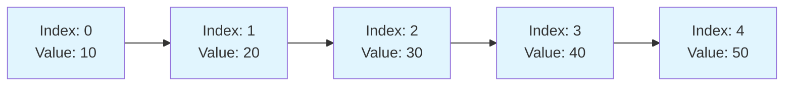
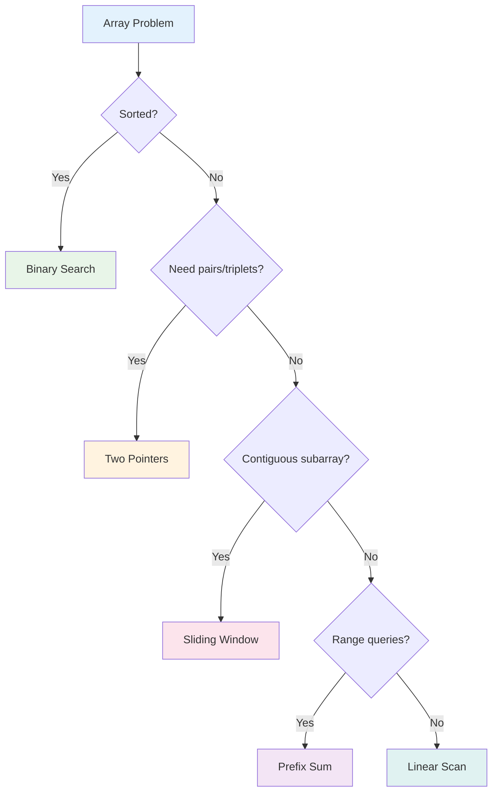

# Complete Array Guide: Your One-Stop Resource for Mastering Arrays

## Table of Contents

- [Complete Array Guide: Your One-Stop Resource for Mastering Arrays](#complete-array-guide-your-one-stop-resource-for-mastering-arrays)
  - [Table of Contents](#table-of-contents)
  - [Introduction](#introduction)
  - [Array Fundamentals](#array-fundamentals)
    - [Key Characteristics](#key-characteristics)
  - [Array Types and Variations](#array-types-and-variations)
    - [Static vs Dynamic Arrays](#static-vs-dynamic-arrays)
    - [Multidimensional Arrays](#multidimensional-arrays)
  - [Core Operations](#core-operations)
    - [Basic Array Operations](#basic-array-operations)
    - [Advanced Operations](#advanced-operations)
  - [Time and Space Complexity Analysis](#time-and-space-complexity-analysis)
    - [Time Complexities](#time-complexities)
    - [Space Complexity](#space-complexity)
  - [Key Algorithms and Techniques](#key-algorithms-and-techniques)
    - [Common Algorithms Used with Arrays](#common-algorithms-used-with-arrays)
    - [Algorithm Visualization](#algorithm-visualization)
  - [Implementation Patterns](#implementation-patterns)
    - [Common Array Implementation Strategies](#common-array-implementation-strategies)
  - [Code Templates and Boilerplate](#code-templates-and-boilerplate)
    - [Essential Java Array Templates](#essential-java-array-templates)
  - [Problem-Solving Patterns](#problem-solving-patterns)
    - [Identifying Array Problem Types](#identifying-array-problem-types)
    - [Common Problem Patterns](#common-problem-patterns)
  - [LeetCode Problem Categories](#leetcode-problem-categories)
    - [Essential Array Problems for Practice](#essential-array-problems-for-practice)
  - [Common Pitfalls and Best Practices](#common-pitfalls-and-best-practices)
    - [Common Mistakes to Avoid](#common-mistakes-to-avoid)
    - [Best Practices](#best-practices)
    - [Edge Cases Checklist](#edge-cases-checklist)
  - [Real-World Applications](#real-world-applications)
    - [Where Arrays Are Used](#where-arrays-are-used)
    - [Performance Considerations](#performance-considerations)
  - [Conclusion](#conclusion)

---

## Introduction

Arrays are the cornerstone of data structures and programming. They represent a collection of elements stored in contiguous memory locations, making them one of the most fundamental and widely-used data structures across all programming languages. This comprehensive guide will equip you with everything you need to master arrays, from basic concepts to advanced problem-solving techniques.

Arrays serve as the building blocks for more complex data structures and are essential for efficient algorithm design. Whether you're preparing for coding interviews, competitive programming, or building real-world applications, understanding arrays thoroughly is crucial for your programming journey.

---

## Array Fundamentals

An array is a data structure that stores elements of the same data type in contiguous memory locations. Each element can be accessed using an index, typically starting from 0 in most programming languages.



### Key Characteristics

1. **Fixed Size**: Traditional arrays have a predetermined size that cannot be changed during runtime
2. **Homogeneous Elements**: All elements must be of the same data type
3. **Random Access**: Any element can be accessed directly using its index in O(1) time
4. **Memory Efficiency**: Elements are stored in contiguous memory locations

---

## Array Types and Variations

### Static vs Dynamic Arrays

| Feature           | Static Array           | Dynamic Array                            |
| ----------------- | ---------------------- | ---------------------------------------- |
| Size              | Fixed at declaration   | Can grow/shrink during runtime           |
| Memory Allocation | Stack or static memory | Heap memory                              |
| Performance       | Faster access          | Slight overhead for resizing             |
| Examples          | `int arr[10]` in C++ | `ArrayList` in Java, `vector` in C++ |

### Multidimensional Arrays

Arrays can have multiple dimensions, with 2D arrays being the most common:

```mermaid
graph TD
    A[2D Array] --> R0[Row 0]
    A --> R1[Row 1]
    A --> R2[Row 2]

    R0 --> R00[ arr[0][0] = 1 ]
    R0 --> R01[ arr[0][1] = 2 ]
    R0 --> R02[ arr[0][2] = 3 ]

    R1 --> R10[ arr[1][0] = 4 ]
    R1 --> R11[ arr[1][1] = 5 ]
    R1 --> R12[ arr[1][2] = 6 ]

    R2 --> R20[ arr[2][0] = 7 ]
    R2 --> R21[ arr[2][1] = 8 ]
    R2 --> R22[ arr[2][2] = 9 ]

    style A fill:#fff3e0 stroke:#333 stroke-width:1px
    style R0 fill:#e3f2fd stroke:#333 stroke-width:1px
    style R1 fill:#e3f2fd stroke:#333 stroke-width:1px
    style R2 fill:#e3f2fd stroke:#333 stroke-width:1px
    style R00 fill:#e8f5e8 stroke:#333 stroke-width:1px
    style R01 fill:#e8f5e8 stroke:#333 stroke-width:1px
    style R02 fill:#e8f5e8 stroke:#333 stroke-width:1px
    style R10 fill:#e8f5e8 stroke:#333 stroke-width:1px
    style R11 fill:#e8f5e8 stroke:#333 stroke-width:1px
    style R12 fill:#e8f5e8 stroke:#333 stroke-width:1px
    style R20 fill:#e8f5e8 stroke:#333 stroke-width:1px
    style R21 fill:#e8f5e8 stroke:#333 stroke-width:1px
    style R22 fill:#e8f5e8 stroke:#333 stroke-width:1px
```

---

## Core Operations

### Basic Array Operations

| Operation                | Description           | Syntax (Java)                    |
| ------------------------ | --------------------- | -------------------------------- |
| **Declaration**    | Create array variable | `int[] arr = new int[5];`      |
| **Initialization** | Assign values         | `int[] arr = {1, 2, 3, 4, 5};` |
| **Access**         | Read element at index | `int value = arr[index];`      |
| **Update**         | Modify element        | `arr[index] = newValue;`       |
| **Length**         | Get array size        | `int size = arr.length;`       |

### Advanced Operations

1. **Insertion**: Adding elements (requires shifting for arrays)
2. **Deletion**: Removing elements (requires shifting for arrays)
3. **Searching**: Finding specific elements
4. **Sorting**: Arranging elements in order
5. **Traversal**: Visiting all elements

---

## Time and Space Complexity Analysis

### Time Complexities

| Operation           | Best Case | Average Case | Worst Case |
| ------------------- | --------- | ------------ | ---------- |
| **Access**    | O(1)      | O(1)         | O(1)       |
| **Search**    | O(1)      | O(n)         | O(n)       |
| **Insertion** | O(1)*     | O(n)         | O(n)       |
| **Deletion**  | O(1)*     | O(n)         | O(n)       |
| **Traversal** | O(n)      | O(n)         | O(n)       |

*O(1) only when inserting/deleting at the end without shifting

### Space Complexity

- **Static Arrays**: O(n) where n is the number of elements
- **Dynamic Arrays**: O(n) with additional overhead for capacity management

```mermaid
graph LR
    A[Array Operations] --> B[O(1) Access]
    A --> C[O(n) Search]
    A --> D[O(n) Insert/Delete]
  
    B --> E[Direct indexing]
    C --> F[Linear scan required]
    D --> G[Element shifting needed]
  
    style B fill:#c8e6c9
    style C fill:#fff3e0
    style D fill:#ffcdd2
```

---

## Key Algorithms and Techniques

### Common Algorithms Used with Arrays

| Algorithm Category       | Algorithms       | Time Complexity | Use Case             |
| ------------------------ | ---------------- | --------------- | -------------------- |
| **Searching**      | Linear Search    | O(n)            | Unsorted arrays      |
|                          | Binary Search    | O(log n)        | Sorted arrays        |
| **Sorting**        | Bubble Sort      | O(n²)          | Educational purposes |
|                          | Quick Sort       | O(n log n)      | General purpose      |
|                          | Merge Sort       | O(n log n)      | Stable sorting       |
| **Two Pointers**   | Two Sum          | O(n)            | Pair finding         |
|                          | Three Sum        | O(n²)          | Triplet problems     |
| **Sliding Window** | Maximum Subarray | O(n)            | Contiguous subarrays |
| **Prefix Sum**     | Range Sum Query  | O(1) query      | Range queries        |

### Algorithm Visualization

```mermaid
flowchart TD
    A[Array Algorithms] --> B[Searching]
    A --> C[Sorting]
    A --> D[Two Pointers]
    A --> E[Sliding Window]
  
    B --> B1[Linear O(n)]
    B --> B2[Binary O(log n)]
  
    C --> C1[Bubble O(n²)]
    C --> C2[Quick O(n log n)]
    C --> C3[Merge O(n log n)]
  
    D --> D1[Two Sum]
    D --> D2[Three Sum]
  
    E --> E1[Fixed Size]
    E --> E2[Variable Size]
```

---

## Implementation Patterns

### Common Array Implementation Strategies

1. **Initialize and Fill Pattern**
2. **Traverse and Process Pattern**
3. **Two Pointers Pattern**
4. **Sliding Window Pattern**
5. **Divide and Conquer Pattern**

---

## Code Templates and Boilerplate

### Essential Java Array Templates

| Template Name                     | Code                                                                                                                                                                                                                                                                                 |
| --------------------------------- | ------------------------------------------------------------------------------------------------------------------------------------------------------------------------------------------------------------------------------------------------------------------------------------ |
| **Basic Array Declaration** | ``javaint[] arr = new int[n];int[] arr = {1, 2, 3, 4, 5};``                                                                                                                                                                                                           |
| **Array Traversal**         | ``javafor(int i = 0; i < arr.length; i++) {    System.out.println(arr[i]);}// Enhanced for loopfor(int num : arr) {    System.out.println(num);}``                                                                                           |
| **Two Pointers**            | ``javaint left = 0, right = arr.length - 1;while(left < right) {    // Process    if(condition) left++;    else right--;}``                                                                                                                       |
| **Sliding Window**          | ``javaint windowStart = 0;for(int windowEnd = 0; windowEnd < arr.length; windowEnd++) {    // Add current element to window    while(windowCondition) {        // Shrink window        windowStart++;    }    // Process window}`` |
| **Binary Search**           | ``javaint left = 0, right = arr.length - 1;while(left <= right) {    int mid = left + (right - left) / 2;    if(arr[mid] == target) return mid;    else if(arr[mid] < target) left = mid + 1;    else right = mid - 1;}return -1;``     |
| **Prefix Sum**              | ``javaint[] prefixSum = new int[arr.length + 1];for(int i = 0; i < arr.length; i++) {    prefixSum[i + 1] = prefixSum[i] + arr[i];}``                                                                                                                       |

---

## Problem-Solving Patterns

### Identifying Array Problem Types



### Common Problem Patterns

1. **Find Maximum/Minimum**: Linear traversal
2. **Search Element**: Binary search for sorted, linear for unsorted
3. **Two Sum Problems**: Hash table or two pointers
4. **Subarray Problems**: Sliding window or prefix sum
5. **Sorting Problems**: Choose appropriate sorting algorithm

---

## LeetCode Problem Categories

### Essential Array Problems for Practice

| Problem                        | LeetCode # | Link                                                                     | Difficulty | Pattern            | Intuition                          |
| ------------------------------ | ---------- | ------------------------------------------------------------------------ | ---------- | ------------------ | ---------------------------------- |
| Two Sum                        | 1          | [Link](https://leetcode.com/problems/two-sum/)                              | Easy       | Hash Map           | Use hash to find complement        |
| Best Time to Buy Stock         | 121        | [Link](https://leetcode.com/problems/best-time-to-buy-and-sell-stock/)      | Easy       | One Pass           | Track minimum and maximum profit   |
| Contains Duplicate             | 217        | [Link](https://leetcode.com/problems/contains-duplicate/)                   | Easy       | Hash Set           | Use set to detect duplicates       |
| Maximum Subarray               | 53         | [Link](https://leetcode.com/problems/maximum-subarray/)                     | Medium     | Kadane's Algorithm | Dynamic programming approach       |
| Product of Array Except Self   | 238        | [Link](https://leetcode.com/problems/product-of-array-except-self/)         | Medium     | Prefix/Suffix      | Calculate left and right products  |
| 3Sum                           | 15         | [Link](https://leetcode.com/problems/3sum/)                                 | Medium     | Two Pointers       | Fix one element, find pairs        |
| Container With Most Water      | 11         | [Link](https://leetcode.com/problems/container-with-most-water/)            | Medium     | Two Pointers       | Move pointer with smaller height   |
| Find Minimum in Rotated Array  | 153        | [Link](https://leetcode.com/problems/find-minimum-in-rotated-sorted-array/) | Medium     | Binary Search      | Modified binary search             |
| Search in Rotated Array        | 33         | [Link](https://leetcode.com/problems/search-in-rotated-sorted-array/)       | Medium     | Binary Search      | Determine sorted half              |
| Merge Intervals                | 56         | [Link](https://leetcode.com/problems/merge-intervals/)                      | Medium     | Sorting            | Sort by start time, merge overlaps |
| Sliding Window Maximum         | 239        | [Link](https://leetcode.com/problems/sliding-window-maximum/)               | Hard       | Deque              | Use deque to track maximums        |
| Trapping Rain Water            | 42         | [Link](https://leetcode.com/problems/trapping-rain-water/)                  | Hard       | Two Pointers       | Track left and right maximums      |
| Median of Two Sorted Arrays    | 4          | [Link](https://leetcode.com/problems/median-of-two-sorted-arrays/)          | Hard       | Binary Search      | Binary search on smaller array     |
| First Missing Positive         | 41         | [Link](https://leetcode.com/problems/first-missing-positive/)               | Hard       | Cyclic Sort        | Use array indices as hash          |
| Largest Rectangle in Histogram | 84         | [Link](https://leetcode.com/problems/largest-rectangle-in-histogram/)       | Hard       | Stack              | Use stack for nearest smaller      |

---

## Common Pitfalls and Best Practices

### Common Mistakes to Avoid

1. **Array Index Out of Bounds**: Always check array bounds
2. **Off-by-One Errors**: Be careful with loop conditions
3. **Null Pointer Exceptions**: Check for null arrays
4. **Memory Leaks**: Properly manage dynamic arrays

### Best Practices

1. **Use meaningful variable names**
2. **Check edge cases** (empty arrays, single elements)
3. **Consider time and space trade-offs**
4. **Use appropriate data structures** for the problem
5. **Test with various input sizes**

### Edge Cases Checklist

- Empty array `[]`
- Single element array `[1]`
- All elements are the same `[5, 5, 5, 5]`
- Already sorted array
- Reverse sorted array
- Array with negative numbers

---

## Real-World Applications

### Where Arrays Are Used

1. **Database Systems**: Storing records and indices
2. **Image Processing**: Pixel data representation
3. **Scientific Computing**: Mathematical computations
4. **Game Development**: Game boards, inventories
5. **Web Development**: Form data, API responses
6. **Machine Learning**: Feature vectors, datasets

### Performance Considerations

- **Cache Locality**: Arrays provide excellent cache performance
- **Memory Overhead**: Minimal overhead compared to other structures
- **Vectorization**: Modern CPUs can process array elements in parallel

---

## Conclusion

Arrays form the foundation of computer science and programming. Mastering arrays involves understanding their properties, common operations, algorithmic patterns, and real-world applications. The key to success lies in:

1. **Understanding fundamentals** thoroughly
2. **Practicing diverse problems** regularly
3. **Recognizing patterns** in different scenarios
4. **Optimizing solutions** for time and space complexity

Whether you're solving algorithm problems, building applications, or preparing for interviews, arrays will be your constant companion. Use this guide as a reference, practice consistently, and gradually tackle more complex problems to build your expertise.

Remember, arrays are not just data structures—they're the building blocks for understanding more advanced topics in computer science. Master them well, and you'll have a solid foundation for your programming journey.
