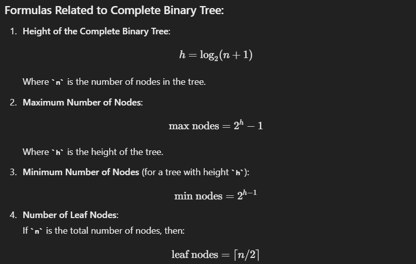

# Complete Binary Tree: Definition and Properties

A **Complete Binary Tree** is a type of binary tree in which every level, except possibly the last, is completely filled, and all nodes are as far left as possible. It's different from a **Perfect Binary Tree**, where all levels are fully filled.

### Properties of a Complete Binary Tree:

1. **Balanced Structure**:

   - The tree is filled from left to right at each level.
   - Only the last level may be incomplete, but nodes in that level are filled starting from the leftmost position.
2. **Height of a Complete Binary Tree**:

   - The height of a complete binary tree with `n` nodes is `O(log n)` (logarithmic in terms of the number of nodes).
3. **Node Count in a Complete Binary Tree**:

   - The maximum number of nodes possible in a complete binary tree of height `h` is \( 2^h - 1 \).
   - If the tree is complete but not perfect, the number of nodes can be any value between \( 2^{h-1} \) (minimum nodes) and \( 2^h - 1 \) (maximum nodes).
4. **Number of Leaf Nodes**:

   - In a complete binary tree of height `h`, the number of leaf nodes can vary between \( 2^{h-1} \) and \( 2^h \), depending on how many nodes are in the last level.
5. **Perfect Binary Tree Subtype**:

   - A perfect binary tree is a special case of a complete binary tree where all levels are completely filled.

### Formulas Related to Complete Binary Tree:

### 15 LeetCode Questions Related to Complete Binary Trees:

1. **Count Complete Tree Nodes** ([LeetCode #222](https://leetcode.com/problems/count-complete-tree-nodes/))

   - Difficulty: Medium
   - Description: Given a complete binary tree, count the number of nodes efficiently.
2. **Check Completeness of a Binary Tree** ([LeetCode #958](https://leetcode.com/problems/check-completeness-of-a-binary-tree/))

   - Difficulty: Medium
   - Description: Determine if a binary tree is complete.
3. **Balanced Binary Tree** ([LeetCode #110](https://leetcode.com/problems/balanced-binary-tree/))

   - Difficulty: Easy
   - Description: Check if the given binary tree is height-balanced.
4. **Minimum Depth of Binary Tree** ([LeetCode #111](https://leetcode.com/problems/minimum-depth-of-binary-tree/))

   - Difficulty: Easy
   - Description: Find the minimum depth of a binary tree.
5. **Maximum Depth of Binary Tree** ([LeetCode #104](https://leetcode.com/problems/maximum-depth-of-binary-tree/))

   - Difficulty: Easy
   - Description: Find the maximum depth of a binary tree.
6. **Kth Smallest Element in a BST** ([LeetCode #230](https://leetcode.com/problems/kth-smallest-element-in-a-bst/))

   - Difficulty: Medium
   - Description: Find the k-th smallest element in a binary search tree.
7. **Binary Tree Level Order Traversal** ([LeetCode #102](https://leetcode.com/problems/binary-tree-level-order-traversal/))

   - Difficulty: Medium
   - Description: Return the level-order traversal of its nodes' values.
8. **Binary Tree Right Side View** ([LeetCode #199](https://leetcode.com/problems/binary-tree-right-side-view/))

   - Difficulty: Medium
   - Description: Return the right side view of a binary tree.
9. **Invert Binary Tree** ([LeetCode #226](https://leetcode.com/problems/invert-binary-tree/))

   - Difficulty: Easy
   - Description: Invert a binary tree.
10. **Binary Tree Maximum Path Sum** ([LeetCode #124](https://leetcode.com/problems/binary-tree-maximum-path-sum/))

    - Difficulty: Hard
    - Description: Find the path in a binary tree that has the largest sum.
11. **Construct Binary Tree from Preorder and Inorder Traversal** ([LeetCode #105](https://leetcode.com/problems/construct-binary-tree-from-preorder-and-inorder-traversal/))

    - Difficulty: Medium
    - Description: Construct a binary tree from preorder and inorder traversal data.
12. **Sum Root to Leaf Numbers** ([LeetCode #129](https://leetcode.com/problems/sum-root-to-leaf-numbers/))

    - Difficulty: Medium
    - Description: Calculate the sum of all numbers formed by root-to-leaf paths.
13. **Serialize and Deserialize Binary Tree** ([LeetCode #297](https://leetcode.com/problems/serialize-and-deserialize-binary-tree/))

    - Difficulty: Hard
    - Description: Implement serialization and deserialization of a binary tree.
14. **Diameter of Binary Tree** ([LeetCode #543](https://leetcode.com/problems/diameter-of-binary-tree/))

    - Difficulty: Easy
    - Description: Find the diameter of a binary tree.
15. **Path Sum III** ([LeetCode #437](https://leetcode.com/problems/path-sum-iii/))

    - Difficulty: Medium
    - Description: Find the number of paths that sum to a given value in a binary tree.

These questions will help solidify your understanding of complete binary trees, as well as related traversal, path sums, and construction techniques.
