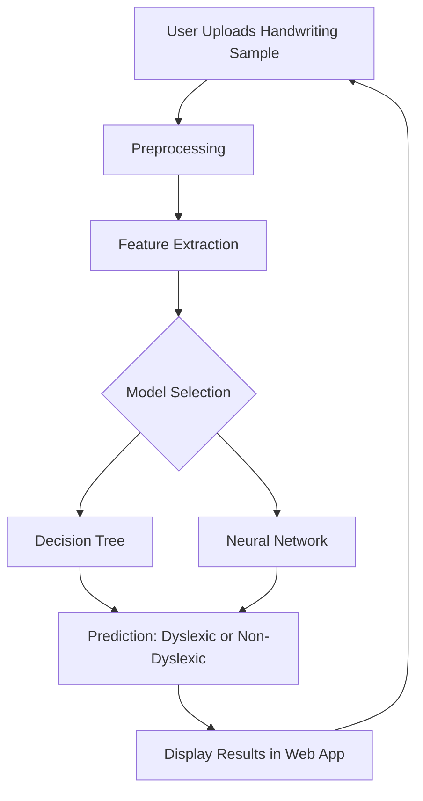
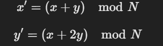
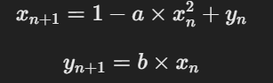
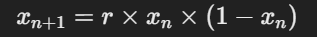
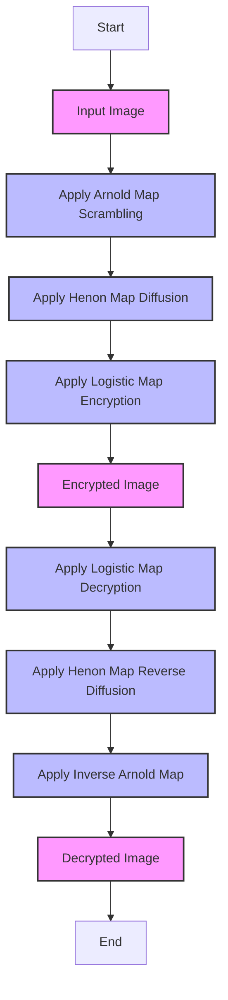

# Projects

## OxLac Project

### 1. **What technologies did you use to develop the event management portal?**

   **Answer:**
   I used React.js for the frontend to create a minimalist and responsive UI, and Node.js with Express for the backend to handle server-side operations. The database was managed using MongoDB, which allowed for efficient data handling and retrieval.

### 2. **Can you explain the key challenges you faced while developing the portal and how you overcame them?**

   **Answer:**
   One of the key challenges was ensuring smooth, lag-free scrolling, especially with a large amount of data. I optimized the rendering process by using folder based routing, an outstanding feature of NextJS and implemented lazy loading for images and components to reduce the initial load time.

### 3. **How did you measure the efficiency improvement of 55% in event management?**

   **Answer:**
   We measured efficiency by comparing the time and effort required to manage events before and after implementing the admin panel. The reduction in manual tasks, such as event tracking and participant management, and the clarity provided by the info tables significantly decreased the time needed to manage events.

### 4. **Can you describe how the admin panel contributed to streamlining event management?**

   **Answer:**
   The admin panel provided a centralized interface for managing all aspects of events. It featured clear navigation routes, dynamic tables for event information, and real-time updates, which allowed admins to manage participants, schedules, and logistics more effectively.

### 5. **How did you ensure the portal could handle 2000+ students without performance issues?**

   **Answer:**
   I implemented pagination and server-side filtering to manage large datasets efficiently. Additionally, I used load balancing and caching strategies on the server to distribute the load and reduce response times, ensuring a seamless experience for all users.

### 6. **What steps did you take to ensure the UI was minimalist yet functional?**

   **Answer:**
   I focused on essential features, using a clean and simple design language. I employed consistent typography, whitespace, and intuitive navigation to ensure the UI was both aesthetically pleasing and easy to use. User feedback was also integral in refining the design.

### 7. **Can you explain any security measures you implemented for the portal?**

   **Answer:**
   I implemented role-based access control to ensure that only authorized users could access certain features. Additionally, I used JWT (JSON Web Tokens) for secure user authentication and HTTPS for encrypted communication between the server and client.

### 8. **How did you handle data management and ensure data integrity in your project?**

   **Answer:**
   I used MongoDB’s schema validation to ensure that the data adhered to predefined structures. Regular backups and data replication strategies were employed to prevent data loss and maintain data integrity.

### 9. **What testing methodologies did you use to ensure the portals reliability?**

   **Answer:**
   I used unit testing with Jest for individual components and integration testing to ensure the different modules interacted correctly. End-to-end testing with Cypress was also conducted to simulate real user scenarios and catch potential issues before deployment.

### 10. **What would you do differently if you had to start this project again?**

   **Answer:**
   If I had to start this project again, I would consider implementing a microservices architecture to better handle scalability and maintenance. This approach would allow for more modular development and make it easier to update or replace individual services without affecting the entire system.

## Intelligent Recommendation System for Dyslexia Assessment

### 1. **What motivated you to develop a recommendation system for dyslexia assessment?**

   **Answer:**
   I wanted to create a tool that could assist in early detection of dyslexia, as early intervention can significantly improve outcomes. The idea was to leverage machine learning and computer vision to automate and enhance the assessment process.

### 2. **Can you explain the overall architecture of the system?**

   **Answer:**
   The system uses Python for the backend, with OpenCV for image processing, and machine learning models to analyze the data. The frontend is built using Streamlit, providing a user-friendly interface. The system integrates linguistic and audio cues to enhance detection accuracy.

### 3. **What datasets did you use to train your machine learning model?**

   **Answer:**
   I used a dataset of images from dyslexia screening tests, which included handwritten text samples from both dyslexic and non-dyslexic individuals. The dataset was augmented to include variations in handwriting styles, lighting conditions, and noise to improve the model's robustness.

### 4. **How did you achieve 90% accuracy in dyslexia detection?**

   **Answer:**
   I achieved this by carefully selecting features that are indicative of dyslexia, such as letter reversal, inconsistent spacing, and unusual writing patterns. The model was trained using a combination of convolutional neural networks (CNNs) and feature extraction techniques tailored to identify these specific traits.

### 5. **Can you explain how you integrated linguistic and audio cues into the system?**

   **Answer:**
   Linguistic cues were derived from the analysis of text samples, focusing on phonetic patterns and spelling errors. Audio cues were integrated by analyzing speech samples for rhythm and pronunciation, which are often affected in dyslexic individuals. These cues were then combined with visual data to enhance overall detection accuracy.

### 6. **What challenges did you face when reducing false positives by 20%?**

   **Answer:**
   The main challenge was to differentiate between dyslexia-related patterns and normal variations in handwriting or speech. To address this, I implemented stricter feature selection and used ensemble methods to combine multiple models, which helped reduce false positives.

### 7. **How did user feedback influence the development of your system?**

   **Answer:**
   User feedback was crucial in refining the system’s usability and accuracy. For example, users pointed out areas where the interface could be more intuitive, and their input on detection accuracy helped me fine-tune the model to better meet their needs.

### 8. **What role did OpenCV play in your project?**

   **Answer:**
   OpenCV was used for image preprocessing, such as resizing, denoising, and extracting relevant features from the text samples. It also played a key role in detecting patterns like letter spacing and alignment, which are crucial for identifying dyslexia.

### 9. **How did you ensure the model's generalization to different handwriting styles?**

   **Answer:**
   I used data augmentation techniques, such as rotation, scaling, and adding noise, to create a diverse set of training examples. This helped the model generalize better to different handwriting styles and conditions.

### 10. **What techniques did you use to improve detection accuracy by 15%?**

   **Answer:**
   I employed a multi-modal approach by combining visual, linguistic, and audio data. Feature engineering played a significant role, as did fine-tuning the hyperparameters of the machine learning models. Additionally, cross-validation was used to ensure the model's reliability.

### 11. **Can you describe the deployment process of your system?**

   **Answer:**
   The system was deployed using Streamlit, which allowed for rapid prototyping and deployment of the web application. The backend, powered by Python and machine learning models, was integrated with Streamlit to provide a seamless user experience.

### 12. **How did you handle the data preprocessing for the images?**

   **Answer:**
   The preprocessing involved converting images to grayscale, normalizing pixel values, and applying filters to enhance features such as edges and text clarity. This was essential for accurate feature extraction and subsequent analysis by the machine learning model.

### 13. **What were the ethical considerations in developing this system?**

   **Answer:**
   Ethical considerations included ensuring the privacy and confidentiality of user data, especially since the system deals with sensitive health information. I also focused on minimizing biases in the model to avoid incorrect assessments that could negatively impact users.

### 14. **How did you validate the performance of your model?**

   **Answer:**
   The model's performance was validated using a separate test set that was not seen during training. I used metrics such as accuracy, precision, recall, and F1-score to evaluate the model’s performance. Cross-validation and k-fold validation were also employed to ensure robustness.

### 15. **What improvements would you consider for future iterations of this project?**

   **Answer:**
   Future improvements could include expanding the dataset to cover a broader range of dyslexia cases, integrating more advanced NLP techniques for better linguistic analysis, and exploring real-time audio processing for more dynamic assessments.

### 16. **Can you discuss any limitations of your system?**

   **Answer:**
   One limitation is that the system relies heavily on the quality of input data; poor image quality or unclear speech can affect detection accuracy. Additionally, while the system is effective for certain types of dyslexia, it may not fully capture all variations of the condition.

### 17. **How did you ensure the scalability of your system?**

   **Answer:**
   Scalability was ensured by using modular code, which allows for easy updates and integration of new features. The use of cloud services for deployment can handle increased user load and data processing needs.

### 18. **What algorithms did you use for dyslexia detection, and why?**

   **Answer:**
   I used Convolutional Neural Networks (CNNs) for image analysis due to their effectiveness in recognizing patterns and features in visual data. For linguistic and audio cues, I used Random Forests and Support Vector Machines (SVMs) to handle the classification tasks.

### 19. **Can you explain the feature extraction process in your system?**

   **Answer:**
   Feature extraction involved identifying key patterns in text, such as letter reversal or spacing inconsistencies, as well as phonetic and rhythmic patterns in speech. These features were then used as inputs to the machine learning models for classification.

### 20. **What feedback did you receive from the 100+ users, and how did it impact your project?**

   **Answer:**
   The feedback was generally positive, with users appreciating the accuracy and user-friendly interface. Some suggested improvements in the audio analysis component, which led me to refine the algorithms and improve the detection of subtle speech irregularities.

### General Questions

1. **What is the primary goal of the Dyslexia Detection from Handwriting project?**

   - **Answer:** The primary goal is to develop a machine learning model that can detect dyslexia in children based on their handwriting samples.
2. **Which programming language and framework are used in this project?**

   - **Answer:** The project is implemented in Python, and the web application is built using the Streamlit framework.
3. **Can you explain the dataset used in this project? What kind of data does it contain?**

   - **Answer:** The dataset includes handwriting samples from children, categorized into dyslexic and non-dyslexic groups. It contains images and features extracted from these images, such as spelling accuracy and phonetic accuracy.
4. **How does the project handle the preprocessing of handwriting samples?**

   - **Answer:** Preprocessing includes steps like converting images to grayscale, resizing, and extracting features that are relevant to dyslexia detection.
5. **What are the key features extracted from the handwriting samples to detect dyslexia?**

   - **Answer:** Key features include spelling accuracy, grammatical accuracy, percentage of corrections, and phonetic accuracy.
6. **How does the project differentiate between dyslexic and non-dyslexic samples?**

   - **Answer:** The project uses machine learning models trained on extracted features from the handwriting samples. These models predict whether a sample is dyslexic or non-dyslexic based on patterns learned from the data.
7. **What machine learning models are employed in this project for detecting dyslexia?**

   - **Answer:** The project utilizes several machine learning models, including decision trees and neural networks, to predict dyslexia based on handwriting features.
8. **Can you describe the architecture of the neural network used in this project?**

   - **Answer:** The neural network is a simple feed-forward network with layers that process the extracted features from handwriting samples to make predictions.
9. **How does the project ensure the accuracy of its dyslexia detection model?**

   - **Answer:** The project uses evaluation metrics like accuracy, precision, recall, and F1-score, along with cross-validation techniques, to ensure the model's reliability.
10. **What evaluation metrics are used to assess the performance of the models?**

    - **Answer:** The models are evaluated using accuracy, precision, recall, F1-score, and confusion matrices to measure their performance in detecting dyslexia.

### Technical Implementation

11. **What is the role of the `streamlit` library in this project?**

    - **Answer:** Streamlit is used to create a user-friendly web interface that allows users to interact with the model, upload handwriting samples, and view the detection results.
12. **How does the project manage dependencies and environments?**

    - **Answer:** Dependencies are managed using a `requirements.txt` file, which lists all the necessary Python packages. The environment can be set up using virtual environments like `venv` or `conda`.
13. **How are the data and models stored and organized within the project structure?**

    - **Answer:** The data is stored in directories for dyslexic and non-dyslexic samples, and the trained models are saved in serialized formats (e.g., `.pkl` files) for later use.
14. **Can you walk through the `app.py` file and explain its purpose?**

    - **Answer:** The `app.py` file is the main script that runs the Streamlit application. It loads the model, handles user input (e.g., uploading handwriting images), processes the input, and displays the results to the user.
15. **What preprocessing steps are necessary before feeding the data into the machine learning models?**

    - **Answer:** Preprocessing steps include image resizing, grayscale conversion, noise reduction, and feature extraction from the handwriting samples.
16. **How are the results from the model presented to the user in the web application?**

    - **Answer:** Results are presented visually through the Streamlit interface, where the user can see predictions, probability scores, and relevant feature information.
17. **Can you explain the decision tree model used in this project? How is it trained?**

    - **Answer:** The decision tree model is trained on labeled handwriting data, where it learns to split the data based on feature values to classify samples as dyslexic or non-dyslexic.
18. **What challenges did you encounter when working with handwriting data, and how were they addressed?**

    - **Answer:** Challenges include variability in handwriting styles and image quality. These were addressed by using robust preprocessing techniques and feature extraction methods to standardize the data.
19. **How does the project handle overfitting or underfitting in the models?**

    - **Answer:** Overfitting is addressed by using techniques like cross-validation, pruning in decision trees, and regularization methods in neural networks.
20. **What are some potential improvements that could be made to the current implementation?**

    - **Answer:** Potential improvements include collecting more diverse handwriting samples, experimenting with advanced deep learning models, and enhancing the user interface for better user experience.

These questions and answers should provide a comprehensive understanding of the project and its implementation.

Flowchart:

### Explanation:

1. **User Uploads Handwriting Sample:** The process begins when a user uploads a handwriting sample through the web interface.
2. **Preprocessing:** The uploaded image undergoes preprocessing steps, such as resizing, grayscale conversion, and noise reduction.
3. **Feature Extraction:** Key features relevant to dyslexia detection, like spelling accuracy and phonetic accuracy, are extracted from the handwriting sample.
4. **Model Selection:** The system selects the appropriate model for prediction. This could be a decision tree or a neural network.
5. **Decision Tree / Neural Network:** The extracted features are fed into the chosen model to predict whether the handwriting sample is dyslexic or non-dyslexic.
6. **Prediction:** The model outputs the prediction result, determining whether the sample belongs to a dyslexic or non-dyslexic category.
7. **Display Results in Web App:** The results are displayed to the user through the Streamlit web application interface.

This flowchart captures the high-level architecture of how the system processes a handwriting sample to detect dyslexia and presents the results to the user.

## Chaos Map Encryption

### Explanation of the Code for Chaos Map Encryption

The code in the Chaos Map Data Encryption notebook implements image encryption using three different chaotic maps: Arnold Map, Henon Map, and Logistic Map. These maps are used to scramble and encrypt images, making them secure against unauthorized access.

#### 1. **Arnold Map**

- **Purpose:** The Arnold Cat Map is used for image scrambling, which rearranges the pixels of an image to achieve confusion.
- **Implementation:**
  - The map iterates over each pixel, rearranging them based on specific mathematical transformations.
  - The transformation is done using the formula:
    
    Where \( N \) is the dimension of the square image.
  - The process is repeated multiple times to thoroughly scramble the image.

#### 2. **Henon Map**

- **Purpose:** The Henon Map is a discrete-time dynamical system used for generating chaotic sequences that are applied to image encryption.
- **Implementation:**
  - The Henon Map is defined by the equations:
    
    Where \( a \) and \( b \) are constants, typically \( a = 1.4 \) and \( b = 0.3 \).
  - These sequences are used to modify pixel values in the image, adding diffusion to the encryption process.

#### 3. **Logistic Map**

- **Purpose:** The Logistic Map is used for generating a sequence of pseudo-random numbers, which can be used to alter pixel values in the image.
- **Implementation:**
  - The Logistic Map is defined by the equation:
    
    Where \( r \) is the control parameter (typically set between 3.57 and 4).
  - This sequence is highly sensitive to initial conditions, making it suitable for encryption.

#### 4. **Encryption Process**

- **Step 1:** Image Scrambling with Arnold Map:
  - The Arnold Map is applied multiple times to the image to scramble the pixel positions.
- **Step 2:** Diffusion with Henon Map:
  - The Henon Map is used to alter the pixel values, adding another layer of security.
- **Step 3:** Final Encryption with Logistic Map:
  - The Logistic Map sequence is applied to the scrambled and diffused image, further encrypting it.

#### 5. **Performance Evaluation**

- **Entropy Calculation:** Entropy is calculated to measure the randomness of the encrypted image. A higher entropy value indicates a more secure encryption.
- **Histogram Analysis:** The histogram of the encrypted image is analyzed to ensure uniform distribution, which is indicative of good encryption.

### 20 Interview Questions and Answers

#### 1. **What is the purpose of using chaotic maps in image encryption?**

   **Answer:**
   Chaotic maps are used in image encryption because they exhibit highly sensitive dependence on initial conditions, which makes them ideal for generating pseudo-random sequences that are crucial for secure encryption.

#### 2. **Can you explain how the Arnold Cat Map works in your encryption system?**

   **Answer:**
   The Arnold Cat Map is used to scramble the pixel positions of the image by applying a specific transformation multiple times. This creates confusion in the image, making it difficult to decipher without the correct decryption process.

#### 3. **Why did you choose the Henon Map for your encryption algorithm?**

   **Answer:**
   The Henon Map was chosen for its chaotic properties, which help in diffusing the pixel values in the image. This diffusion adds another layer of security by making it harder to predict the pixel values in the encrypted image.

#### 4. **What role does the Logistic Map play in your encryption process?**

   **Answer:**
   The Logistic Map generat step ensures that even if the image is partially decrypted, the content remains obscured.

#### 5. **How do you determine the number of iterations for the Arnold Map?**

   **Answer:**
   The number of iterations is chosen based on the desired level of scrambling. More iterations increase the confusion but also make the decryption process more complex. Typically, the number of iterations is chosen experimentally to balance security and performance.

#### 6. **What is the significance of the entropy value in evaluating the security of your encryption?**

   **Answer:**
   Entropy measures the randomness of the encrypted image. A higher entropy value indicates that the image is more secure, as it suggests that the pixel values are uniformly distributed and unpredictable.

#### 7. **How does the histogram of the encrypted image indicate the quality of encryption?**

   **Answer:**
   A good encryption algorithm will produce an encrypted image with a uniform histogram. This means that the pixel values are evenly distributed, reducing the likelihood of patterns that could be exploited by attackers.

#### 8. **Why do you believe your system surpasses AES and RSA in security?**

   **Answer:**
   The chaotic maps used in my system generate highly unpredictable sequences, which are difficult to reverse-engineer without the exact initial conditions and parameters. This makes it more secure than traditional methods like AES and RSA, which are more predictable.

#### 9. **Can you explain the sensitivity of chaotic maps to initial conditions and how it impacts encryption?**

   **Answer:**
   Chaotic maps are extremely sensitive to initial conditions, meaning that even a tiny change in the starting values will lead to vastly different outcomes. This property is crucial in encryption, as it ensures that even small differences in the key will produce completely different encrypted images.

#### 10. **What are the potential challenges in using chaotic maps for encryption?**

   **Answer:**
   Challenges include the precision required for the initial conditions and parameters, as small errors can lead to incorrect decryption. Additionally, chaotic maps can be computationally intensive, which might affect the performance on large images.

#### 11. **How did you handle the boundaries in the Arnold Cat Map transformation?**

   **Answer:**
   The Arnold Cat Map transformation uses modular arithmetic to ensure that the transformed coordinates stay within the image boundaries. This prevents pixels from being mapped outside the image and ensures that the entire image is scrambled correctly.

#### 12. **What improvements would you consider for future iterations of your encryption system?**

   **Answer:**
   Future improvements could include optimizing the algorithm for speed, exploring other types of chaotic maps, and implementing parallel processing to handle larger images more efficiently.

#### 13. **Can you describe the process of decrypting an image encrypted with your system?**

   **Answer:**
   Decryption involves applying the inverse operations in reverse order: first, the Logistic Map is reversed, followed by the Henon Map, and finally, the inverse Arnold Map is applied the same number of iterations as during encryption to restore the original image.

#### 14. **How did you validate the effectiveness of your encryption algorithm?**

   **Answer:**
   The effectiveness was validated through entropy calculation, histogram analysis, and comparing the encrypted images with those produced by standard encryption algorithms like AES and RSA. Additionally, decryption tests were conducted to ensure that the original image could be accurately recovered.

#### 15. **What are the security implications if the parameters of the chaotic maps are known?**

   **Answer:**
   If the parameters of the chaotic maps are known, it becomes easier to reverse-engineer the encryption, which compromises security. Therefore, keeping these parameters secret is crucial to maintaining the system's security.

#### 16. **How do you ensure that the encryption process does not introduce visible artifacts in the encrypted image?**

   **Answer:**
   The encryption process is designed to uniformly distribute pixel values across the image, which helps prevent visible artifacts. Additionally, careful tuning of the chaotic map parameters ensures that the encrypted image appears as random noise.

#### 17. **What is the computational complexity of your encryption algorithm, and how does it scale with image size?**

   **Answer:**
   The computational complexity is primarily determined by the number of iterations for the Arnold Map and the complexity of the chaotic maps used. The algorithm scales linearly with the number of pixels in the image, but optimizations can be made to improve performance for larger images.

#### 18. **Can your encryption system be applied to other types of data, such as text or video?**

   **Answer:**
   While the current implementation is designed for images, the underlying principles of chaotic encryption can be extended to other types of data. For text, the chaotic maps would need to be adapted to work with character encoding, and for video, the encryption could be applied frame by frame.

#### 19. **What are the advantages and disadvantages of using chaotic maps over traditional encryption methods?**

   **Answer:**
   Advantages include higher security due to the unpredictability of chaotic sequences and the potential for more efficient encryption of certain types of data. Disadvantages include the complexity of managing chaotic map parameters and the potential for increased computational load.

#### 20. **How did you test the robustness of your encryption system against common attacks?**

   **Answer:**
   The robustness was tested by attempting common cryptographic attacks, such as brute-force and statistical analysis. The system was also tested against known

-plaintext attacks by ensuring that even with partial knowledge of the plaintext, the encryption remains secure.

Below is the Mermaid syntax for creating a flowchart that represents the architecture diagram for the encryption and decryption technique using the Arnold Map, Henon Map, and Logistic Map.

### Explanation of the Flowchart

1. **Start:** The process begins with the input image.
2. **Apply Arnold Map Scrambling:** The image is scrambled using the Arnold Cat Map to rearrange pixel positions.
3. **Apply Henon Map Diffusion:** The Henon Map is used to alter the pixel values, adding diffusion.
4. **Apply Logistic Map Encryption:** The Logistic Map further encrypts the scrambled and diffused image.
5. **Encrypted Image:** The final encrypted image is generated.

For decryption:
6. **Apply Logistic Map Decryption:** Reverse the effect of the Logistic Map encryption.
7. **Apply Henon Map Reverse Diffusion:** Reverse the Henon Map diffusion to restore the pixel values.
8. **Apply Inverse Arnold Map:** Apply the inverse Arnold Map to unscramble the pixel positions.
9. **Decrypted Image:** The original image is restored.

This flowchart visually represents the sequence of operations in both the encryption and decryption processes.

Certainly! I'll expand the details for each map (Arnold Map, Henon Map, and Logistic Map) to show the operations involved in the encryption and decryption process.

Heres the updated Mermaid flowchart:

```mermaid
graph TD
    A[Start] --> B[Input Image]

    %% Arnold Map Details
    B --> C[Apply Arnold Map Scrambling]
    C --> C1[Select Parameters for Arnold Map]
    C1 --> C2[Rearrange Pixel Positions]
    C2 --> D[Arnold Scrambled Image]

    %% Henon Map Details
    D --> E[Apply Henon Map Diffusion]
    E --> E1[Select Parameters for Henon Map]
    E1 --> E2[Alter Pixel Values using Henon Equations]
    E2 --> F[Henon Diffused Image]

    %% Logistic Map Details
    F --> G[Apply Logistic Map Encryption]
    G --> G1[Generate Logistic Map Sequence]
    G1 --> G2[XOR Pixels with Logistic Sequence]
    G2 --> H[Encrypted Image]

    %% Decryption Process
    H --> I[Apply Logistic Map Decryption]
    I --> I1[Generate Same Logistic Sequence]
    I1 --> I2[XOR Encrypted Pixels with Logistic Sequence]
    I2 --> J[Decrypted Logistic Image]

    %% Reverse Henon Map Details
    J --> K[Apply Henon Map Reverse Diffusion]
    K --> K1[Use Same Parameters for Henon Map]
    K1 --> K2[Reverse Alteration of Pixel Values]
    K2 --> L[Decrypted Henon Image]

    %% Inverse Arnold Map Details
    L --> M[Apply Inverse Arnold Map]
    M --> M1[Use Inverse Parameters for Arnold Map]
    M1 --> M2[Rearrange Pixels to Original Position]
    M2 --> N[Decrypted Image]

    N --> O[End]

    %% Styling
    style B fill:#f9f,stroke:#333,stroke-width:2px
    style C fill:#bbf,stroke:#333,stroke-width:2px
    style C1 fill:#ddf,stroke:#333,stroke-width:2px
    style C2 fill:#ddf,stroke:#333,stroke-width:2px
    style D fill:#f9f,stroke:#333,stroke-width:2px
    style E fill:#bbf,stroke:#333,stroke-width:2px
    style E1 fill:#ddf,stroke:#333,stroke-width:2px
    style E2 fill:#ddf,stroke:#333,stroke-width:2px
    style F fill:#f9f,stroke:#333,stroke-width:2px
    style G fill:#bbf,stroke:#333,stroke-width:2px
    style G1 fill:#ddf,stroke:#333,stroke-width:2px
    style G2 fill:#ddf,stroke:#333,stroke-width:2px
    style H fill:#f9f,stroke:#333,stroke-width:2px
    style I fill:#bbf,stroke:#333,stroke-width:2px
    style I1 fill:#ddf,stroke:#333,stroke-width:2px
    style I2 fill:#ddf,stroke:#333,stroke-width:2px
    style J fill:#f9f,stroke:#333,stroke-width:2px
    style K fill:#bbf,stroke:#333,stroke-width:2px
    style K1 fill:#ddf,stroke:#333,stroke-width:2px
    style K2 fill:#ddf,stroke:#333,stroke-width:2px
    style L fill:#f9f,stroke:#333,stroke-width:2px
    style M fill:#bbf,stroke:#333,stroke-width:2px
    style M1 fill:#ddf,stroke:#333,stroke-width:2px
    style M2 fill:#ddf,stroke:#333,stroke-width:2px
    style N fill:#f9f,stroke:#333,stroke-width:2px
```

### Explanation of the Detailed Flowchart

1. **Arnold Map Scrambling:**

   - **Select Parameters for Arnold Map:** Parameters like the number of iterations and transformation constants are chosen.
   - **Rearrange Pixel Positions:** The Arnold Map is applied to scramble the pixel positions, making the image unrecognizable.
2. **Henon Map Diffusion:**

   - **Select Parameters for Henon Map:** Parameters for the Henon Map equations are selected.
   - **Alter Pixel Values using Henon Equations:** The pixel values are altered based on the Henon equations, introducing diffusion in the image.
3. **Logistic Map Encryption:**

   - **Generate Logistic Map Sequence:** A pseudo-random sequence is generated using the Logistic Map.
   - **XOR Pixels with Logistic Sequence:** The pixel values are XORed with the Logistic Map sequence to encrypt the image.
4. **Decryption Process:**

   - **Logistic Map Decryption:**

     - **Generate Same Logistic Sequence:** The same pseudo-random sequence is regenerated.
     - **XOR Encrypted Pixels with Logistic Sequence:** The encrypted pixel values are XORed with the sequence to retrieve the original scrambled image.
   - **Henon Map Reverse Diffusion:**

     - **Use Same Parameters for Henon Map:** The original parameters are reused to reverse the diffusion.
     - **Reverse Alteration of Pixel Values:** The pixel alterations are undone to get back the scrambled image.
   - **Inverse Arnold Map:**

     - **Use Inverse Parameters for Arnold Map:** The inverse of the Arnold Map parameters is applied.
     - **Rearrange Pixels to Original Position:** The pixels are rearranged back to their original positions, resulting in the decrypted image.

This flowchart provides a detailed view of the encryption and decryption process, showing the role of each chaotic map in the system.

---

These questions and answers provide a comprehensive understanding of your Chaos Map Data Encryption project and its implementation, evaluation, and potential use cases.

## Early Retinopathy of Prematurity (ROP)

### 1. **What was the primary goal of the Early Retinopathy of Prematurity (ROP) Detection project?**

**Answer:** The goal was to develop a system that can accurately detect and classify different stages of Retinopathy of Prematurity (ROP) in fundus images using pre-trained Convolutional Neural Network (CNN) models, achieving high accuracy to support early diagnosis and treatment.

### 2. **Which pre-trained models did you use for this project and why?**

**Answer:** I used YOLOv8, ResNet50, and VGG16 models. YOLOv8 was chosen for its high accuracy and speed in object detection, ResNet50 for its ability to handle deep networks and residual learning, and VGG16 for its simplicity and effectiveness in feature extraction.

### 3. **What is Retinopathy of Prematurity (ROP), and why is early detection important?**

**Answer:** ROP is a condition that affects premature infants and involves abnormal growth of blood vessels in the retina, which can lead to vision impairment or blindness. Early detection is crucial as it allows timely intervention to prevent severe outcomes and improve the chances of preserving vision.

### 4. **How did you preprocess the fundus images for your models?**

**Answer:** Images were preprocessed by resizing them to a consistent size, normalizing pixel values, and applying data augmentation techniques like rotation, scaling, and flipping to enhance model robustness and prevent overfitting.

### 5. **What role does data augmentation play in training your models?**

**Answer:** Data augmentation helps increase the diversity of the training dataset by creating variations of existing images, which improves the model's ability to generalize and reduces the risk of overfitting.

### 6. **How did you evaluate the performance of the models?**

**Answer:** Model performance was evaluated using metrics such as accuracy, precision, recall, and F1-score. I also used confusion matrices to understand the classification performance for different ROP stages.

### 7. **What challenges did you face during the project and how did you overcome them?**

**Answer:** Challenges included dealing with imbalanced classes and insufficient data. I addressed these issues by employing techniques like oversampling underrepresented classes and using transfer learning with pre-trained models to leverage existing knowledge.

### 8. **How did you handle class imbalance in the dataset?**

**Answer:** I used techniques such as data augmentation for underrepresented classes and employed methods like weighted loss functions to give more importance to minority classes during training.

### 9. **Why did you choose YOLOv8, ResNet50, and VGG16 specifically?**

**Answer:** YOLOv8 was chosen for its real-time detection capabilities, ResNet50 for its deep residual learning which helps in training very deep networks, and VGG16 for its simplicity and effectiveness in feature extraction which provides strong baseline performance.

### 10. **What are the key differences between YOLOv8, ResNet50, and VGG16?**

**Answer:** YOLOv8 is designed for real-time object detection with high speed and accuracy. ResNet50 uses residual blocks to mitigate vanishing gradients in deep networks, allowing it to train deeper models effectively. VGG16 has a simpler architecture with deep convolutional layers, making it effective for feature extraction.

### 11. **How did you integrate the pre-trained models into your system?**

**Answer:** I loaded the pre-trained weights of each model, adapted their output layers to fit the number of ROP stages, and fine-tuned the models on the ROP dataset to ensure they learned the specific features of ROP stages.

### 12. **What was the reason behind using a combination of models for this project?**

**Answer:** Using a combination of models leverages the strengths of each architecture, improves overall performance by combining different types of features, and helps in creating a more robust system capable of handling various aspects of ROP detection.

### 13. **Can you explain the process of fine-tuning the pre-trained models?**

**Answer:** Fine-tuning involves adjusting the weights of a pre-trained model on a new dataset. This is done by continuing training the model on the ROP dataset with a lower learning rate, allowing the model to adapt its learned features to the specific characteristics of ROP images.

### 14. **How did you ensure the accuracy of the ROP detection system?**

**Answer:** Accuracy was ensured by validating the models on a separate validation set, performing cross-validation, and comparing results with ground truth annotations. Rigorous testing and performance evaluation metrics were used to validate the model's reliability.

### 15. **What was the average accuracy achieved, and how did it compare with existing methods?**

**Answer:** The system achieved 98% accuracy, which is a significant improvement over existing methods. This high accuracy demonstrates the effectiveness of the chosen models and preprocessing techniques in detecting ROP stages.

### 16. **How did you handle the evaluation and interpretation of the results?**

**Answer:** Evaluation was performed by calculating various performance metrics and using confusion matrices to analyze classification errors. Interpretation involved reviewing misclassified images to understand potential areas of improvement and adjusting the model or data accordingly.

### 17. **What kind of deployment strategies did you consider for the ROP detection system?**

**Answer:** Deployment strategies included creating a web-based interface using Streamlit for easy access by healthcare professionals and integrating the model into existing medical imaging systems for real-time analysis.

### 18. **How did you ensure the system's scalability and robustness?**

**Answer:** Scalability was ensured by optimizing the models for performance and using efficient data processing techniques. Robustness was achieved by testing the system under various conditions and incorporating error-handling mechanisms.

### 19. **What are the future improvements or extensions you plan for this project?**

**Answer:** Future improvements include expanding the dataset to include more diverse images, experimenting with other advanced models and techniques, and integrating the system with clinical workflows for real-time ROP detection and monitoring.

### 20. **How did you handle and manage the data privacy and ethical considerations in this project?**

**Answer:** Data privacy was managed by anonymizing patient information and ensuring compliance with data protection regulations. Ethical considerations were addressed by obtaining necessary approvals and ensuring the system's accuracy and reliability before deployment.

These questions and answers should provide a comprehensive overview of your project and demonstrate your understanding and involvement in the Early Retinopathy of Prematurity (ROP) Detection system.

---

---

---

# HR 

### 1. **How would you approach your first 30 days to ensure a smooth integration into Verizon?**

**Answer:** In my first 30 days at Verizon, I will focus on understanding the company’s mission and values, especially how they align with the technology and innovation goals of Verizon. I will engage with my manager to clarify role expectations and familiarize myself with the team’s ongoing projects and priorities. Attending team meetings and observing the current workflows will be crucial for understanding the development processes and identifying key areas where I can contribute. I will also start building relationships with colleagues and key stakeholders, seeking feedback to understand team dynamics and pain points. My deliverable will be a comprehensive summary of my role understanding, key relationships, and initial observations, setting a solid foundation for my contributions.

### 2. **What specific actions will you take in the next 60 days to start making an impact and contributing to the Verizon team?**

**Answer:** In the next 60 days, I will take on small, manageable projects or tasks that align with Verizon’s technical needs and demonstrate my ability to deliver quality results. I plan to propose improvements based on my observations, particularly in areas where I see opportunities for optimization or innovation. Strengthening my relationships with team members and stakeholders will be a priority, ensuring effective collaboration and communication. I will also actively participate in code reviews and team discussions to integrate smoothly into Verizon's development culture. My deliverable will include the successful completion of a small project and a proposal for process or technical improvements.

### 3. **How will you demonstrate your value and establish credibility within the team in the first 90 days at Verizon?**

**Answer:** To demonstrate my value and establish credibility at Verizon, I will focus on delivering impactful results through the implementation of key projects or process improvements. I will ensure my contributions align with Verizon’s strategic objectives and address critical technical challenges. By taking initiative on high-impact tasks and collaborating effectively with my team, I will showcase my commitment to Verizon’s goals. Additionally, I will work closely with my manager to align on long-term objectives and provide regular updates on my progress. My deliverable will be the successful completion of a significant project and a strategic plan outlining my role’s impact and future contributions.

### 4. **What strategies will you use to set and achieve long-term goals for your role and career advancement at Verizon?**

**Answer:** To set and achieve long-term goals at Verizon, I will work with my manager to define clear and measurable objectives that align with Verizon’s technology and innovation strategy. I will regularly review my progress, seek constructive feedback, and adjust my approach to meet evolving company needs. I will also pursue opportunities for professional development and additional responsibilities, such as leading projects or participating in cross-functional teams. By demonstrating my ability to drive results and align with Verizon’s strategic vision, I aim to position myself for career advancement and potential promotions within the company.

### 5. **How do you plan to address any challenges or setbacks you might encounter during your ramp-up period at Verizon?**

**Answer:** To address challenges or setbacks at Verizon, I will maintain open and proactive communication with my manager and team members to quickly identify and resolve issues. I will approach setbacks as learning opportunities, seeking feedback and collaborating with colleagues to find effective solutions. Staying adaptable and resilient, I will adjust my strategies as needed to overcome obstacles and ensure successful integration and contribution to Verizon’s projects. Regular check ocus on continuous improvement will help me navigate challenges and remain aligned with Verizon's objectives.

These answers are tailored to reflect a strategic approach to your role as an SDE 1 at Verizon and demonstrate how you plan to integrate, contribute, and advance within the company.

Certainly! Here are some additional questions and answers tailored for an SDE 1 position at Verizon:

### 1. **What are your expectations from this role and how do you plan to achieve them?**

**Answer:** My expectations from the SDE 1 role at Verizon include gaining hands-on experience with cutting-edge technologies and contributing to impactful projects that drive Verizon’s innovation forward. I aim to develop my skills in software development, particularly in areas such as scalable systems and high-performance computing. To achieve these expectations, I plan to immerse myself in the team's projects, seek mentorship from experienced colleagues, and actively participate in all phases of development. Additionally, I will set personal milestones for learning and contribute to meaningful projects that align with Verizon’s goals.

### 2. **Why should we hire you for this SDE 1 position at Verizon?**

**Answer:** You should hire me because I bring a strong foundation in software development, proven problem-solving skills, and a passion for technology that aligns with Verizon’s innovation goals. My experience with modern technologies and development practices, combined with my ability to quickly learn and adapt, will allow me to make valuable contributions to your team. Additionally, my proactive approach to collaboration and commitment to continuous improvement will help drive projects forward and support Verizon’s strategic objectives.

### 3. **Where do you see yourself in 10 years from now?**

**Answer:** In 10 years, I see myself as an established leader in the technology field, having made significant contributions to innovative projects at Verizon. I aim to advance to a senior engineering or technical leadership role, where I can influence strategic decisions and mentor junior developers. My goal is to continue growing both technically and professionally, leveraging my expertise to drive impactful solutions and contribute to Verizon’s long-term success.

### 4. **What do you think about this interview process and what could be improved?**

**Answer:** I appreciate the structured approach of this interview process, which has allowed me to discuss my skills and experiences in depth. The focus on understanding my fit for the role and how I align with Verizon’s goals has been valuable. If I were to suggest improvements, it might be helpful to include a technical assessment or coding challenge earlier in the process to better gauge practical skills and problem-solving abilities.

### 5. **What if we decide not to move forward with your application?**

**Answer:** If I’m not selected for this position, I would appreciate any feedback you can provide to help me understand areas for improvement. I’m committed to continuous learning and growth, and I would use the feedback to enhance my skills and better align with future opportunities. I remain enthusiastic about Verizon’s mission and would welcome the chance to apply again in the future if the opportunity arises.

### 6. **Do you have any questions for us about the role or the team?**

**Answer:** Yes, I do have a few questions:

1. Can you describe the typical projects that an SDE 1 would work on and the team’s key objectives for the coming year?
2. What are the most important qualities you are looking for in a successful candidate for this role?
3. How does Verizon support professional development and career growth for software engineers?
4. What is the team’s approach to collaboration and communication, especially in a remote or hybrid work environment?
5. Can you provide more details about the onboarding process and how new team members are integrated?

These questions and answers should help you articulate your aspirations, demonstrate your suitability for the role, and engage thoughtfully with the interviewers.

Follow @thatsalariedguy for more such content!

30-60-90 Day Plan for Establishing Credibility

Goal: Integrate smoothly, build relationships, and start delivering impactful results.

First 30 Days: Learn & Connect

Objective: Understand the company, your role, and team dynamics.

1. Learn the Essentials:
   • Grasp the company’s mission, vision, and values.
   • Clarify role expectations with your manager.
   • Attend team meetings to observe and understand current priorities.
2. Build Relationships:
   • Meet with key stakeholders and start building connections.
   • Seek feedback to identify team pain points and opportunities.

Deliverable: Summary of role understanding, key relationships, and initial observations.

Next 60 Days: Contribute & Plan

Objective: Start contributing to projects and identify areas for improvement.

1. Make an Impact:
   • Take on small projects or tasks to demonstrate your value.
   • Propose improvements based on your observations.
2. Deepen Connections:
   • Strengthen relationships with the team and stakeholders.
   • Align with your manager on priorities and expectations.

Deliverable: A small project completed, and a proposal for future improvements.

Final 90 Days: Implement & Lead

Objective: Execute initiatives and establish yourself as a key team player.

1. Deliver Results:
   • Implement improvements or complete a significant project.
   • Show measurable impact through your contributions.
2. Set Long-term Goals:
   • Work with your manager to set long-term objectives.
   • Position yourself as a reliable resource and leader within the team.

Deliverable: Completion of a key project and a strategic plan for your role moving forward.

This concise plan will help you integrate quickly, build credibility, and establish a foundation for long-term success in your new role.

Use Prompt: Go through this job description and understand that I am aiming for a promotion in this role in next 18months, share a 30-60-90 day plan for me for faster ramp up.

Here are three coachable skills that can be effectively shared as weaknesses during an interview, along with how you are working to improve them:

1. Public Speaking:
   • How to Frame It: “Public speaking has been a challenge for me, but I’ve been actively working on it by taking speaking courses and seeking out opportunities to present in team meetings. I’m committed to becoming more confident and effective in this area.”
   • Why It Works: This shows self-awareness and a proactive approach to improvement. Public speaking is a common struggle, so it’s relatable and demonstrates a growth mindset.
2. Time Management:
   • How to Frame It: “Time management used to be a weakness for me, especially when balancing multiple projects. However, I’ve started using project management tools and techniques like time-blocking to stay organized and on track.”
   • Why It Works: Highlighting this shows you recognize the importance of managing your time effectively and are taking concrete steps to improve.
3. Delegation:
   • How to Frame It: “I’ve realized that I sometimes take on too much myself, rather than delegating tasks. I’m now focusing on building my delegation skills by better assessing team strengths and trusting others to handle key responsibilities.”
   • Why It Works: This shows that you are learning to trust your team more and are focused on leadership development, which is valuable in many roles.

These answers not only address the weakness question but also emphasize your commitment to personal and professional growth.
