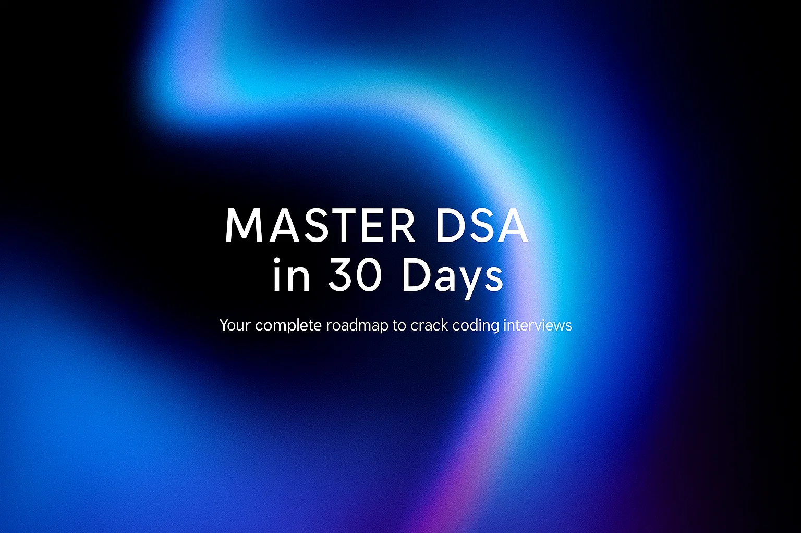

# 🚀 Master DSA in 30 Days – The Ultimate Day-Wise Roadmap

If you want to crack coding interviews at top tech companies, you need structured preparation.

This **30-day roadmap** gives you the  **most important DSA problems** , their intuition, and company tags—arranged **day by day** so you stay consistent.

---

## 📅 Week 1: Arrays & Strings (Days 1–7)

### **Day 1 – Arrays Basics**

| Problem                         | Link                                                                    | Intuition                                          | Key Steps / Notes                              | Company               | Video                                               |
| ------------------------------- | ----------------------------------------------------------------------- | -------------------------------------------------- | ---------------------------------------------- | --------------------- | --------------------------------------------------- |
| Two Sum                         | [LeetCode](https://leetcode.com/problems/two-sum/)                         | Use hashmap to track complements while traversing. | Store value:index; check for `target - num`. | Amazon, Microsoft     | [YouTube](https://www.youtube.com/watch?v=KLlXCFG5TnA) |
| Best Time to Buy and Sell Stock | [LeetCode](https://leetcode.com/problems/best-time-to-buy-and-sell-stock/) | Track min price and max profit difference.         | Update min price, compare profit at each step. | Google, Goldman Sachs | [YouTube](https://www.youtube.com/watch?v=1pkOgXD63yU) |
| Maximum Subarray (Kadane’s)    | [LeetCode](https://leetcode.com/problems/maximum-subarray/)                | Decide to extend or restart subarray at each step. | `curr = max(num, curr+num)`                  | Apple, Microsoft      | [YouTube](https://www.youtube.com/watch?v=5WZl3MMT0Eg) |

### **Day 2 – Sliding Window Basics**

| Problem                                        | Link                                                                                   | Intuition                                                   | Key Steps / Notes                       | Company           | Video                                               |
| ---------------------------------------------- | -------------------------------------------------------------------------------------- | ----------------------------------------------------------- | --------------------------------------- | ----------------- | --------------------------------------------------- |
| Longest Substring Without Repeating Characters | [LeetCode](https://leetcode.com/problems/longest-substring-without-repeating-characters/) | Maintain a sliding window and shrink when duplicates found. | Use set/map, track max length.          | Amazon, Bloomberg | [YouTube](https://www.youtube.com/watch?v=wiGpQwVHdE0) |
| Minimum Size Subarray Sum                      | [LeetCode](https://leetcode.com/problems/minimum-size-subarray-sum/)                      | Expand until sum ≥ target, shrink from left.               | Sliding window sum, track min length.   | Microsoft, Google | [YouTube](https://www.youtube.com/watch?v=Ofl4KgFhLsM) |
| Longest Repeating Character Replacement        | [LeetCode](https://leetcode.com/problems/longest-repeating-character-replacement/)        | Replace characters to maximize valid substring.             | Shrink when `(window - maxFreq > k)`. | Facebook, Amazon  | [YouTube](https://www.youtube.com/watch?v=gqXU1UyA8pk) |

### **Day 3 – Prefix & Subarrays**

| Problem                      | Link                                                                 | Intuition                         | Key Steps / Notes                       | Company             | Video                                               |
| ---------------------------- | -------------------------------------------------------------------- | --------------------------------- | --------------------------------------- | ------------------- | --------------------------------------------------- |
| Subarray Sum Equals K        | [LeetCode](https://leetcode.com/problems/subarray-sum-equals-k/)        | Prefix sums + hashmap of counts.  | Track cumulative sum and count matches. | Google, Amazon      | [YouTube](https://www.youtube.com/watch?v=fFVZt-6sgyo) |
| Product of Array Except Self | [LeetCode](https://leetcode.com/problems/product-of-array-except-self/) | Compute prefix * suffix products. | Two passes, avoid division.             | Microsoft, Facebook | [YouTube](https://www.youtube.com/watch?v=bNvIQI2wAjk) |

### **Day 4 – Matrix Patterns**

| Problem           | Link                                                      | Intuition                     | Key Steps / Notes                 | Company       | Video                                               |
| ----------------- | --------------------------------------------------------- | ----------------------------- | --------------------------------- | ------------- | --------------------------------------------------- |
| Set Matrix Zeroes | [LeetCode](https://leetcode.com/problems/set-matrix-zeroes/) | Use first row/col as markers. | O(1) extra space solution.        | Amazon, Adobe | [YouTube](https://www.youtube.com/watch?v=T41rL0L3Pnw) |
| Rotate Image      | [LeetCode](https://leetcode.com/problems/rotate-image/)      | Transpose + reverse rows.     | Classic in-place matrix rotation. | Google, Apple | [YouTube](https://www.youtube.com/watch?v=fMSJSS7eO1w) |

### **Day 5 – String Basics**

| Problem        | Link                                                   | Intuition                              | Key Steps / Notes     | Company           | Video                                               |
| -------------- | ------------------------------------------------------ | -------------------------------------- | --------------------- | ----------------- | --------------------------------------------------- |
| Valid Anagram  | [LeetCode](https://leetcode.com/problems/valid-anagram/)  | Compare frequency counts.              | Hashmap or array[26]. | Amazon, Adobe     | [YouTube](https://www.youtube.com/watch?v=9UtInBqnCgA) |
| Group Anagrams | [LeetCode](https://leetcode.com/problems/group-anagrams/) | Use sorted string / freq count as key. | Hashmap grouping.     | Google, Bloomberg | [YouTube](https://www.youtube.com/watch?v=vzdNOK2oB2E) |

### **Day 6 – String Advanced**

| Problem                       | Link                                                                  | Intuition                      | Key Steps / Notes       | Company           | Video                                               |
| ----------------------------- | --------------------------------------------------------------------- | ------------------------------ | ----------------------- | ----------------- | --------------------------------------------------- |
| Encode & Decode Strings       | [LeetCode](https://leetcode.com/problems/encode-and-decode-strings/)     | Use length+delimiter encoding. | Careful parsing.        | Google            | [YouTube](https://www.youtube.com/watch?v=B1k_sxOSgv8) |
| Longest Palindromic Substring | [LeetCode](https://leetcode.com/problems/longest-palindromic-substring/) | Expand around center.          | Check odd/even centers. | Amazon, Microsoft | [YouTube](https://www.youtube.com/watch?v=XYQecbcd6_c) |

### **Day 7 – Review / Mixed Practice**

| Problem                   | Link                                                              | Intuition                      | Key Steps / Notes                      | Company          | Video                                               |
| ------------------------- | ----------------------------------------------------------------- | ------------------------------ | -------------------------------------- | ---------------- | --------------------------------------------------- |
| Container With Most Water | [LeetCode](https://leetcode.com/problems/container-with-most-water/) | Two pointers inward from ends. | Max area by moving shorter line.       | Google, Amazon   | [YouTube](https://www.youtube.com/watch?v=UuiTKBwPgAo) |
| Trapping Rain Water       | [LeetCode](https://leetcode.com/problems/trapping-rain-water/)       | Precompute leftMax & rightMax. | Water = min(left, right) – height[i]. | Microsoft, Apple | [YouTube](https://www.youtube.com/watch?v=ZI2z5pq0TqA) |

---

## 📅 Week 2: Hashing, Stack, Queue, Recursion, Backtracking (Days 8–14)

### **Day 8 – Hashing**

| Problem                 | Link                                                            | Intuition                                      | Key Steps                | Company           | Video                                               |
| ----------------------- | --------------------------------------------------------------- | ---------------------------------------------- | ------------------------ | ----------------- | --------------------------------------------------- |
| Valid Sudoku            | [LeetCode](https://leetcode.com/problems/valid-sudoku/)            | Track row, col, and box constraints with sets. | Hashsets for duplicates. | Google, Bloomberg | [YouTube](https://www.youtube.com/watch?v=TjFXEUCMqI8) |
| Top K Frequent Elements | [LeetCode](https://leetcode.com/problems/top-k-frequent-elements/) | Use hashmap + heap/bucket sort.                | Count → max heap.       | Amazon, Facebook  | [YouTube](https://www.youtube.com/watch?v=YPTqKIgVk-k) |

### **Day 9 – Stack Basics**

| Problem           | Link                                                      | Intuition                       | Key Steps            | Company           | Video                                               |
| ----------------- | --------------------------------------------------------- | ------------------------------- | -------------------- | ----------------- | --------------------------------------------------- |
| Valid Parentheses | [LeetCode](https://leetcode.com/problems/valid-parentheses/) | Stack to match opening-closing. | Push/pop check.      | Amazon, Adobe     | [YouTube](https://www.youtube.com/watch?v=WTzjTskDFMg) |
| Min Stack         | [LeetCode](https://leetcode.com/problems/min-stack/)         | Track min with auxiliary stack. | Maintain (val, min). | Google, Microsoft | [YouTube](https://www.youtube.com/watch?v=qkLl7nAwDPo) |

### **Day 10 – Stack Advanced**

| Problem                          | Link                                                                     | Intuition                        | Key Steps                             | Company           | Video                                               |
| -------------------------------- | ------------------------------------------------------------------------ | -------------------------------- | ------------------------------------- | ----------------- | --------------------------------------------------- |
| Evaluate Reverse Polish Notation | [LeetCode](https://leetcode.com/problems/evaluate-reverse-polish-notation/) | Stack evaluation of expressions. | Push numbers, pop for operators.      | Facebook, Amazon  | [YouTube](https://www.youtube.com/watch?v=iu0082c4HDE) |
| Daily Temperatures               | [LeetCode](https://leetcode.com/problems/daily-temperatures/)               | Monotonic decreasing stack.      | Store indices, pop when warmer found. | Microsoft, Google | [YouTube](https://www.youtube.com/watch?v=cTBiBSnjO3c) |

### **Day 11 – Queue & Heap**

| Problem                       | Link                                                                    | Intuition                         | Key Steps               | Company           | Video                                               |
| ----------------------------- | ----------------------------------------------------------------------- | --------------------------------- | ----------------------- | ----------------- | --------------------------------------------------- |
| Implement Queue using Stacks  | [LeetCode](https://leetcode.com/problems/implement-queue-using-stacks/)    | Push stack & pop stack technique. | Amortized O(1).         | Amazon            | [YouTube](https://www.youtube.com/watch?v=3Et9MrMc02A) |
| Kth Largest Element in Stream | [LeetCode](https://leetcode.com/problems/kth-largest-element-in-a-stream/) | Min-heap of size k.               | Maintain heap property. | Google, Bloomberg | [YouTube](https://www.youtube.com/watch?v=hOjcdrqMoQ8) |

### **Day 12 – Recursion Basics**

| Problem      | Link                                                 | Intuition                          | Key Steps         | Company          | Video                                               |
| ------------ | ---------------------------------------------------- | ---------------------------------- | ----------------- | ---------------- | --------------------------------------------------- |
| Subsets      | [LeetCode](https://leetcode.com/problems/subsets/)      | Backtrack include/exclude choices. | DFS recursion.    | Google, Amazon   | [YouTube](https://www.youtube.com/watch?v=REOH22Xwdkk) |
| Permutations | [LeetCode](https://leetcode.com/problems/permutations/) | Swap positions and recurse.        | DFS backtracking. | Microsoft, Adobe | [YouTube](https://www.youtube.com/watch?v=s7AvT7cGdSo) |

### **Day 13 – Recursion Advanced**

| Problem                 | Link                                                            | Intuition                                | Key Steps                 | Company           | Video                                               |
| ----------------------- | --------------------------------------------------------------- | ---------------------------------------- | ------------------------- | ----------------- | --------------------------------------------------- |
| Combination Sum         | [LeetCode](https://leetcode.com/problems/combination-sum/)         | Backtrack with candidates.               | Choose/skip same element. | Amazon, Bloomberg | [YouTube](https://www.youtube.com/watch?v=GBKI9VSKdGg) |
| Palindrome Partitioning | [LeetCode](https://leetcode.com/problems/palindrome-partitioning/) | Backtrack partitions + palindrome check. | DFS + expand partitions.  | Facebook, Google  | [YouTube](https://www.youtube.com/watch?v=3jvWodd7ht0) |

### **Day 14 – Backtracking**

| Problem     | Link                                                | Intuition                       | Key Steps                | Company           | Video                                               |
| ----------- | --------------------------------------------------- | ------------------------------- | ------------------------ | ----------------- | --------------------------------------------------- |
| N-Queens    | [LeetCode](https://leetcode.com/problems/n-queens/)    | Place queens safely row by row. | Use sets for cols/diags. | Google, Microsoft | [YouTube](https://www.youtube.com/watch?v=Ph95IHmRp5M) |
| Word Search | [LeetCode](https://leetcode.com/problems/word-search/) | DFS backtrack through board.    | Mark visited, backtrack. | Amazon, Apple     | [YouTube](https://www.youtube.com/watch?v=m9TrOL1ETxI) |

---

## 📅 Week 3: Linked List & Trees (Days 15–21)

### **Day 15 – Linked List Basics**

| Problem                | Link                                                           | Intuition                     | Key Steps               | Company           | Video                                               |
| ---------------------- | -------------------------------------------------------------- | ----------------------------- | ----------------------- | ----------------- | --------------------------------------------------- |
| Reverse Linked List    | [LeetCode](https://leetcode.com/problems/reverse-linked-list/)    | Iteratively reverse pointers. | Track prev, curr, next. | Amazon, Microsoft | [YouTube](https://www.youtube.com/watch?v=G0_I-ZF0S38) |
| Merge Two Sorted Lists | [LeetCode](https://leetcode.com/problems/merge-two-sorted-lists/) | Merge step of merge sort.     | Two pointers.           | Google, Apple     | [YouTube](https://www.youtube.com/watch?v=XIdigk956u0) |

### **Day 16 – Linked List Advanced**

| Problem           | Link                                                      | Intuition                                 | Key Steps                   | Company           | Video                                               |
| ----------------- | --------------------------------------------------------- | ----------------------------------------- | --------------------------- | ----------------- | --------------------------------------------------- |
| Linked List Cycle | [LeetCode](https://leetcode.com/problems/linked-list-cycle/) | Floyd’s Tortoise & Hare cycle detection. | Fast/slow pointers.         | Amazon, Microsoft | [YouTube](https://www.youtube.com/watch?v=gBTe7lFR3vc) |
| Reorder List      | [LeetCode](https://leetcode.com/problems/reorder-list/)      | Split + reverse + merge.                  | Middle → reverse → merge. | Facebook, Google  | [YouTube](https://www.youtube.com/watch?v=S5bfdUTrKLM) |

### **Day 17 – Binary Tree Basics**

| Problem                           | Link                                                                      | Intuition               | Key Steps              | Company             | Video                                               |
| --------------------------------- | ------------------------------------------------------------------------- | ----------------------- | ---------------------- | ------------------- | --------------------------------------------------- |
| Maximum Depth of Binary Tree      | [LeetCode](https://leetcode.com/problems/maximum-depth-of-binary-tree/)      | DFS height calculation. | Recursion base case.   | Amazon, Google      | [YouTube](https://www.youtube.com/watch?v=2xngMJtX6Gg) |
| Binary Tree Level Order Traversal | [LeetCode](https://leetcode.com/problems/binary-tree-level-order-traversal/) | BFS queue per level.    | Track size each level. | Microsoft, Facebook | [YouTube](https://www.youtube.com/watch?v=6ZnyEApgFYg) |

### **Day 18 – Binary Tree Advanced**

| Problem                      | Link                                                                            | Intuition                            | Key Steps             | Company              | Video                                               |
| ---------------------------- | ------------------------------------------------------------------------------- | ------------------------------------ | --------------------- | -------------------- | --------------------------------------------------- |
| Lowest Common Ancestor       | [LeetCode](https://leetcode.com/problems/lowest-common-ancestor-of-a-binary-tree/) | DFS return node if found in subtree. | Post-order recursion. | Google, Amazon       | [YouTube](https://www.youtube.com/watch?v=13m9ZCB8gjw) |
| Serialize & Deserialize Tree | [LeetCode](https://leetcode.com/problems/serialize-and-deserialize-binary-tree/)   | BFS or preorder encoding.            | Handle null markers.  | Microsoft, Bloomberg | [YouTube](https://www.youtube.com/watch?v=-YbXySKJsX8) |

### **Day 19 – Binary Search Trees**

| Problem             | Link                                                                  | Intuition                         | Key Steps                      | Company             | Video                                               |
| ------------------- | --------------------------------------------------------------------- | --------------------------------- | ------------------------------ | ------------------- | --------------------------------------------------- |
| Validate BST        | [LeetCode](https://leetcode.com/problems/validate-binary-search-tree/)   | Inorder traversal must be sorted. | Recursion with min/max bounds. | Amazon, Google      | [YouTube](https://www.youtube.com/watch?v=s6ATEkipzow) |
| Kth Smallest in BST | [LeetCode](https://leetcode.com/problems/kth-smallest-element-in-a-bst/) | Inorder traversal counts nodes.   | Stop at kth.                   | Facebook, Microsoft | [YouTube](https://www.youtube.com/watch?v=5LUXSvjmGCw) |

### **Day 20 – Trie**

| Problem        | Link                                                               | Intuition                         | Key Steps           | Company             | Video                                               |
| -------------- | ------------------------------------------------------------------ | --------------------------------- | ------------------- | ------------------- | --------------------------------------------------- |
| Implement Trie | [LeetCode](https://leetcode.com/problems/implement-trie-prefix-tree/) | Each node maps chars → children. | Insert/search path. | Google, Amazon      | [YouTube](https://www.youtube.com/watch?v=oobqoCJlHA0) |
| Word Search II | [LeetCode](https://leetcode.com/problems/word-search-ii/)             | Trie + DFS board search.          | Prune using prefix. | Microsoft, Facebook | [YouTube](https://www.youtube.com/watch?v=asbcE9mZz_U) |

### **Day 21 – Review**

| Problem             | Link                                                                       | Intuition                | Key Steps        | Company        | Video                                               |
| ------------------- | -------------------------------------------------------------------------- | ------------------------ | ---------------- | -------------- | --------------------------------------------------- |
| Flatten Binary Tree | [LeetCode](https://leetcode.com/problems/flatten-binary-tree-to-linked-list/) | Recursively restructure. | Right-first DFS. | Google, Amazon | [YouTube](https://www.youtube.com/watch?v=NHfqId8A6NM) |

---

## 📅 Week 4: Graphs, DP, Greedy & Final Practice (Days 22–30)

### **Day 22 – Graph Basics**

| Problem           | Link                                                      | Intuition                       | Key Steps                   | Company           | Video                                               |
| ----------------- | --------------------------------------------------------- | ------------------------------- | --------------------------- | ----------------- | --------------------------------------------------- |
| Number of Islands | [LeetCode](https://leetcode.com/problems/number-of-islands/) | DFS/BFS connected components.   | Mark visited land.          | Amazon, Bloomberg | [YouTube](https://www.youtube.com/watch?v=pV2kpPD66nE) |
| Clone Graph       | [LeetCode](https://leetcode.com/problems/clone-graph/)       | Hashmap old→new, BFS/DFS copy. | Copy neighbors recursively. | Facebook, Google  | [YouTube](https://www.youtube.com/watch?v=mQeF6bN8hMk) |

### **Day 23 – Graph Advanced**

| Problem                     | Link                                                                | Intuition                         | Key Steps               | Company           | Video                                               |
| --------------------------- | ------------------------------------------------------------------- | --------------------------------- | ----------------------- | ----------------- | --------------------------------------------------- |
| Course Schedule             | [LeetCode](https://leetcode.com/problems/course-schedule/)             | Detect cycle in graph (toposort). | BFS indegree/DFS cycle. | Microsoft, Amazon | [YouTube](https://www.youtube.com/watch?v=EgI5nU9etnU) |
| Pacific Atlantic Water Flow | [LeetCode](https://leetcode.com/problems/pacific-atlantic-water-flow/) | Reverse DFS from oceans.          | Multi-source BFS.       | Google            | [YouTube](https://www.youtube.com/watch?v=s-VkcjHqkGI) |

### **Day 24 – Dynamic Programming Basics**

| Problem         | Link                                                    | Intuition                | Key Steps                        | Company           | Video                                               |
| --------------- | ------------------------------------------------------- | ------------------------ | -------------------------------- | ----------------- | --------------------------------------------------- |
| Climbing Stairs | [LeetCode](https://leetcode.com/problems/climbing-stairs/) | Fibonacci pattern.       | dp[i] = dp[i-1]+dp[i-2].         | Amazon, Adobe     | [YouTube](https://www.youtube.com/watch?v=Y0lT9Fck7qI) |
| House Robber    | [LeetCode](https://leetcode.com/problems/house-robber/)    | Choose rob/skip with dp. | dp[i]=max(dp[i-1], dp[i-2]+val). | Google, Microsoft | [YouTube](https://www.youtube.com/watch?v=73r3KWiEvyk) |

### **Day 25 – Dynamic Programming Advanced**

| Problem     | Link                                                | Intuition                         | Key Steps                    | Company          | Video                                               |
| ----------- | --------------------------------------------------- | --------------------------------- | ---------------------------- | ---------------- | --------------------------------------------------- |
| Coin Change | [LeetCode](https://leetcode.com/problems/coin-change/) | Bottom-up DP min coins.           | dp[amt]=min(dp[amt-coin])+1. | Google, PayPal   | [YouTube](https://www.youtube.com/watch?v=H9bfqozjoqs) |
| Word Break  | [LeetCode](https://leetcode.com/problems/word-break/)  | dp[i] true if prefix + dict word. | Nested loop + set lookup.    | Amazon, Facebook | [YouTube](https://www.youtube.com/watch?v=Sx9NNgInc3A) |

### **Day 26 – DP on Grids**

| Problem          | Link                                                     | Intuition                         | Key Steps                       | Company          | Video                                               |
| ---------------- | -------------------------------------------------------- | --------------------------------- | ------------------------------- | ---------------- | --------------------------------------------------- |
| Unique Paths     | [LeetCode](https://leetcode.com/problems/unique-paths/)     | DP from top-left to bottom-right. | dp[i][j]=dp[i-1][j]+dp[i][j-1]. | Microsoft, Adobe | [YouTube](https://www.youtube.com/watch?v=IlEsdxuD4lY) |
| Minimum Path Sum | [LeetCode](https://leetcode.com/problems/minimum-path-sum/) | Choose min of top/left.           | dp[i][j]=grid+min(top,left).    | Amazon, Google   | [YouTube](https://www.youtube.com/watch?v=t1shZ8_s6jc) |

### **Day 27 – Greedy**

| Problem         | Link                                                    | Intuition                       | Key Steps             | Company           | Video                                               |
| --------------- | ------------------------------------------------------- | ------------------------------- | --------------------- | ----------------- | --------------------------------------------------- |
| Jump Game       | [LeetCode](https://leetcode.com/problems/jump-game/)       | Track farthest index reachable. | Greedy expansion.     | Google, Facebook  | [YouTube](https://www.youtube.com/watch?v=Yan0cv2cLy8) |
| Merge Intervals | [LeetCode](https://leetcode.com/problems/merge-intervals/) | Sort then merge overlaps.       | Compare end vs start. | Amazon, Microsoft | [YouTube](https://www.youtube.com/watch?v=44H3cEC2fFM) |

### **Day 28 – Advanced DP**

| Problem                        | Link                                                                   | Intuition                      | Key Steps             | Company             | Video                                               |
| ------------------------------ | ---------------------------------------------------------------------- | ------------------------------ | --------------------- | ------------------- | --------------------------------------------------- |
| Longest Increasing Subsequence | [LeetCode](https://leetcode.com/problems/longest-increasing-subsequence/) | DP with binary search.         | Patience sorting.     | Google, Amazon      | [YouTube](https://www.youtube.com/watch?v=cjWnW0hdF1Y) |
| Edit Distance                  | [LeetCode](https://leetcode.com/problems/edit-distance/)                  | DP with insert/delete/replace. | dp[i][j] transitions. | Microsoft, Facebook | [YouTube](https://www.youtube.com/watch?v=XYi2-LPrwm4) |

### **Day 29 – Hard DP**

| Problem                     | Link                                                                | Intuition                       | Key Steps                  | Company             | Video                                               |
| --------------------------- | ------------------------------------------------------------------- | ------------------------------- | -------------------------- | ------------------- | --------------------------------------------------- |
| Maximal Rectangle           | [LeetCode](https://leetcode.com/problems/maximal-rectangle/)           | DP heights + largest histogram. | Row histogram → stack.    | Amazon, Google      | [YouTube](https://www.youtube.com/watch?v=vgcE5Cx_iOc) |
| Regular Expression Matching | [LeetCode](https://leetcode.com/problems/regular-expression-matching/) | DP on pattern vs string.        | dp[i][j] with `*` cases. | Facebook, Microsoft | [YouTube](https://www.youtube.com/watch?v=HAA8mgxlov8) |

### **Day 30 – Final Review (Mixed Mock)**

| Problem                     | Link                                                                | Intuition                 | Key Steps                    | Company          | Video                                               |
| --------------------------- | ------------------------------------------------------------------- | ------------------------- | ---------------------------- | ---------------- | --------------------------------------------------- |
| Trapping Rain Water         | [LeetCode](https://leetcode.com/problems/trapping-rain-water/)         | Two pointer max tracking. | Water=min(maxL,maxR)-height. | Amazon, Apple    | [YouTube](https://www.youtube.com/watch?v=ZI2z5pq0TqA) |
| Median of Two Sorted Arrays | [LeetCode](https://leetcode.com/problems/median-of-two-sorted-arrays/) | Binary search partition.  | Left/right half balance.     | Google, Facebook | [YouTube](https://www.youtube.com/watch?v=q6IEA26hvXc) |

---

## 🎯 Final Tips

1. **Focus on patterns, not problems.**
2. **Solve 5–6 problems per day** consistently.
3. **Revise weekly** with mock problems.
4. **Use discussions & editorials only after trying.**

By the end of this roadmap, you’ll have solved **150+ high-impact problems** that cover almost every important interview pattern.
