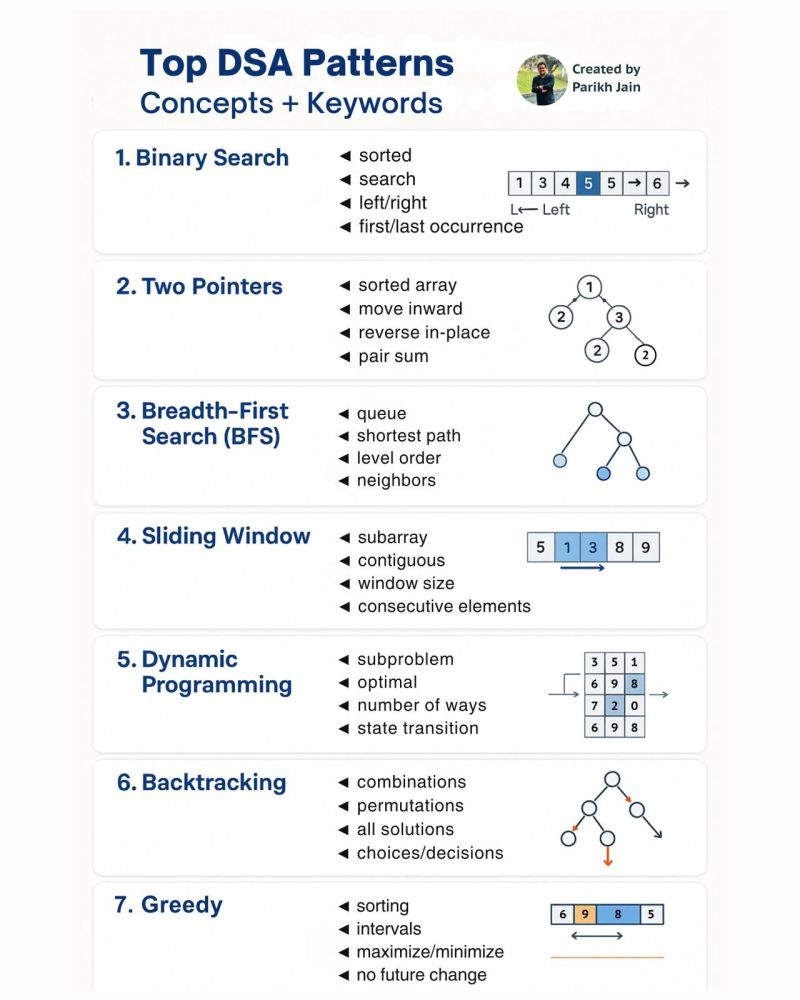
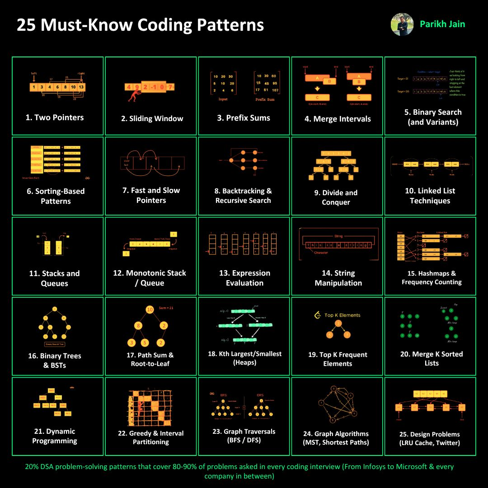

# Master DSA: The Ultimate Pattern-Based Roadmap for Coding Interviews

*Transform your interview preparation by learning the 20% of patterns that solve 80% of coding problems*

---

Are you tired of solving hundreds of random coding problems without seeing real improvement? Struggling to approach new problems during interviews? You're not alone. The secret isn't grinding through more problems—it's learning to  **think in patterns** .

## The Problem with Traditional DSA Study

Most students fall into the same trap: they solve problems one by one, hoping that quantity will somehow transform into quality. But when faced with unseen problems in interviews, they freeze up. The issue isn't weak logic—it's the wrong approach.

## The Pattern-Based Solution

Instead of memorizing solutions, successful candidates recognize underlying patterns. Once you identify these patterns, even the most challenging problems become approachable puzzles with familiar frameworks.

This comprehensive roadmap will teach you to:

* ✅ **Identify key problem-solving patterns**
* ✅ **Recognize signals and clues** that indicate which pattern to use
* ✅ **Master 25 essential patterns** through curated practice problems
* ✅ **Cover 250-300 problems** strategically from LeetCode and other platforms
* ✅ **Build confidence** for any coding interview

---

## 🎯 The 25 Essential DSA Patterns

Here are the core patterns that will transform your problem-solving approach:

### **Foundation Patterns (1-7)**

| Pattern                            | Description                                       | Key Use Cases                          |
| ---------------------------------- | ------------------------------------------------- | -------------------------------------- |
| **Two Pointers**             | Moving pointers inward/outward to meet conditions | Pair sum, palindromes, merging         |
| **Sliding Window**           | Dynamic window optimization over subarrays        | Substring problems, max/min subarrays  |
| **Prefix Sums**              | Preprocessing cumulative values for range queries | Range sum queries, subarray problems   |
| **Merge Intervals**          | Handling interval overlap and merging             | Meeting rooms, calendar conflicts      |
| **Binary Search & Variants** | Advanced search techniques over sorted data       | Search in rotated arrays, peak finding |
| **Sorting-Based Patterns**   | Leveraging sorting for greedy/pairing logic       | Pair problems, interval scheduling     |
| **Fast and Slow Pointers**   | Cycle detection and linked list problems          | Cycle detection, finding middle        |

### **Intermediate Patterns (8-14)**

| Pattern                                   | Description                                         | Key Use Cases                            |
| ----------------------------------------- | --------------------------------------------------- | ---------------------------------------- |
| **Backtracking & Recursive Search** | Exploring all possibilities systematically          | N-Queens, Sudoku, permutations           |
| **Divide and Conquer**              | Splitting problems and combining solutions          | Merge sort, closest pair                 |
| **Linked List Techniques**          | In-place manipulation and pointer tricks            | Reversal, rotation, merging              |
| **Stacks and Queues**               | Classic usage for parsing and state management      | Expression parsing, BFS/DFS              |
| **Monotonic Stack/Queue**           | Maintaining order for next greater/smaller problems | Next greater element, sliding window max |
| **Expression Evaluation**           | Two-stack approach for mathematical expressions     | Calculator problems, formula parsing     |
| **String Manipulation**             | In-place modifications and pattern matching         | Anagrams, string transformations         |

### **Advanced Patterns (15-21)**

| Pattern                                 | Description                                  | Key Use Cases                         |
| --------------------------------------- | -------------------------------------------- | ------------------------------------- |
| **Hashmaps & Frequency Counting** | Grouping and counting elements efficiently   | Anagrams, subarray sum problems       |
| **Binary Trees & BSTs**           | Tree traversal and BST properties            | Tree construction, validation         |
| **Path Sum & Root-to-Leaf**       | DFS-based pathfinding in trees               | Path sum, root-to-leaf paths          |
| **Kth Largest/Smallest**          | Selection algorithms using heaps/quickselect | Top K problems, order statistics      |
| **Top K Frequent Elements**       | Frequency counting with heaps or bucket sort | Most frequent elements, top K         |
| **Merge K Sorted Lists**          | Multi-way merging techniques                 | Merging multiple sorted structures    |
| **Dynamic Programming**           | Optimal substructure and memoization         | Knapsack, range DP, sequence problems |

### **Expert Patterns (22-25)**

| Pattern                                  | Description                              | Key Use Cases                                |
| ---------------------------------------- | ---------------------------------------- | -------------------------------------------- |
| **Greedy & Interval Partitioning** | Local optimal choices for global results | Activity selection, job scheduling           |
| **Graph Traversals (BFS, DFS)**    | Fundamental graph navigation             | Path finding, connectivity                   |
| **Advanced Graph Algorithms**      | Complex graph problems and optimizations | Shortest paths, MST, topological sort        |
| **System Design Problems**         | Large-scale system components            | LRU Cache, Rate Limiter, distributed systems |

---

## 🚀 Time Complexity Quick Reference

Choose the right approach based on input constraints:

| Input Size (`n`) | Max Time Complexity | Suitable Algorithms         | Example Problems                |
| ------------------ | ------------------- | --------------------------- | ------------------------------- |
| n ≤ 12            | O(n!)               | Recursion, Backtracking     | Generate all permutations       |
| n ≤ 25            | O(2ⁿ)              | Recursion, Bit manipulation | Generate all subsets            |
| n ≤ 100           | O(n⁴)              | Dynamic Programming         | 4Sum problem                    |
| n ≤ 500           | O(n³)              | Dynamic Programming         | Triangle path sum               |
| n ≤ 10⁴          | O(n²)              | DP, Graphs, Trees           | Bubble sort, graph problems     |
| n ≤ 10⁶          | O(n log n)          | Sorting, Binary search      | Merge sort, efficient searching |
| n ≤ 10⁸          | O(n)                | Greedy, Mathematical        | Linear scan algorithms          |
| n > 10⁸           | O(log n) or O(1)    | Mathematical, Binary search | Optimized search, math formulas |

---

## 🔑 The High-Impact 8: Must-Know Patterns for Interviews

Focus on these 8 patterns first—they cover the majority of interview questions:

1. **Two Pointer** - Perfect for sorted arrays and linked lists
2. **Top K Elements** - Master heaps and quickselect
3. **Topological Sort** - Essential for dependency problems
4. **Binary Tree DFS** - Recursive tree traversals
5. **Binary Tree BFS** - Level-order and shortest path problems
6. **Modified Binary Search** - Handle rotated arrays and conditions
7. **Subset Generation** - Combinations using backtracking or bitmasks
8. **Sliding Window** - Efficient subarray/substring problems

---

## 📚 Recommended Resources

### Essential Practice Sheets:SDE Sheet by Striver : [Striver’s SDE Sheet – Top Coding Interview Problems](https://takeuforward.org/interviews/strivers-sde-sheet-top-coding-interview-problems "Striver’s SDE Sheet – Top Coding Interview Problems")

* A2Z Sheet by Striver : [Strivers A2Z DSA Course](https://takeuforward.org/strivers-a2z-dsa-course/strivers-a2z-dsa-course-sheet-2 "Strivers A2Z DSA Course")
* SDE Sheet by Love Babbar : [DSA Excel Sheet by Love Babbar](../docs/DSA-Sheet-by-Love-Babbar.xlsx "DSA Excel Sheet by Love Babbar")
* GFG Article by Love Babbar : [DSA Sheet by Love Babbar](https://www.geeksforgeeks.org/dsa/dsa-sheet-by-love-babbar/ "DSA Sheet by Love Babbar")

### Study Strategy:

1. **Master one pattern at a time** - Don't rush through multiple patterns
2. **Solve 5-6 problems per pattern** - Quality over quantity
3. **Track your progress** - Maintain a learning log
4. **Revisit patterns regularly** - Spaced repetition builds mastery
5. **Time yourself** - Simulate interview conditions

---

## 🎯 From Any Company to FAANG

Whether you're preparing for product-based giants like Microsoft, Amazon, or startups and service-based companies like Infosys, Wipro — these patterns will be your backbone.

Master the patterns. Crack the interviews.

Refer this Github Repository for `Collection of Leetcode Company Tag Problems`: [Leetcode Company Frequency by xizhang20181005](https://github.com/xizhang20181005/Leetcode_company_frequency)

Refer this GFG Article to learn about important top 10 algorithms and data structures for competitive coding: [Top 10 Algorithms and Data Structures for Competitive Programming](https://www.geeksforgeeks.org/top-algorithms-and-data-structures-for-competitive-programming/)

This Roadmap is originally devised by Parikh Jain : [LinkedIn Post by Parikh Jain](https://www.linkedin.com/posts/parikh-jain-79568798_20-dsa-problem-solving-patterns-that-cover-activity-7354732744213479424--u7t/?utm_source=social_share_video_v2&utm_medium=android_app&rcm=ACoAADdHOYoBnHIo9d6lNpw6CQWIxcSfDNFea1c&utm_campaign=whatsapp "LinkedIn Post by Parikh Jain")

---

## Your Next Steps

1. **Start with the High-Impact 8** patterns listed above
2. **Practice 5-6 problems** for each pattern before moving on
3. **Focus on recognition** - train yourself to identify which pattern applies
4. **Build speed gradually** - accuracy first, then optimize for time
5. **Mock interview regularly** - apply patterns under pressure

Remember: The goal isn't to memorize solutions, but to recognize patterns and adapt them to new problems. Master these 25 patterns, and you'll approach any coding interview with confidence.

---

*Ready to transform your DSA preparation? Start with pattern #1 today and build your way to interview success.*
